# Setup of the Developer Environment

## Content
* [Overview](#overview)
* [Prerequisites](#prerequisites)
* [Before you start](#before)
* [Exercise 1: Set up Office 365 Educational trial subscription](#ex1)
* [Exercise 2: Set up demo data in the School Data Sync Admin Portal](#ex2)
* [Exercise 3: Set up Azure free trial subscription](#ex3)
* [Exercise 4: Provision a virtual machine for development](#ex4)
* [Continue with lab 1](#continue)

---

## Overview
In this lab, you will set up an Office 365 Educational trial subscription, populate your School Data Sync environment with demo data, and provision resources in the Azure subscription to use for development of further labs.

**This lab is a requirement for the other hands-on labs.**

[Back to top](#content)

---

## Prerequisites

* You will need a cell phone and a credit card for identity verification.

[Back to top](#content)

---

## Before you start

> &#x1F53A; If you already have an Office 365 subscription, please **use an alternate browser or use private mode!** This will help avoid any issues with conflicting accounts.
>
> Clear your browsers cache and restart your browser.
>
> **Do not skip exercise 1!** Even if you already have an Office 365 subscription and address, follow exercise 1 and create a new account.
>
> Use the account created in exercise 1 for **all the following exercises and hands-on labs!**
>
> To register for a free trial use an e-mail address and a phone number that has **not been used for a free trial** yet! &#x1F53A;

> &#x1F53A; If you encounter a problem or error message check the text below whatever step you just performed. For known issues workarounds have been added to the lab instructions **after** the description and images of the regular instruction. &#x1F53A;

> It may happen that due to new feature implementations and redesign of the user interface parts of the instructions may be inaccurate. We are updating the content regularly to keep the content up to date.
>
> If you find an issue please submit it as an issue in GitHub and we will fix it as soon as possible. Thank you in advance and sorry for any inconveniences this may cause.

[Back to top](#content)

---

## Exercise 1: Set up Office 365 Educational trial subscription

1. Open a InPrivate or Incognito browser window (`Ctrl + Shift + P` in Edge and Internet Explorer and Firefox or `Ctrl + Shift + N` in Google Chrome)
 and browse to the signup page. Use this [promo code link](https://signup.microsoft.com/Signup?OfferId=03ee83a5-5cb4-4545-aca9-33ead43f222a,d764709a-7763-45ef-a2a8-db5b8b6ae704&DL=ENTERPRISEPREMIUM_FACULTY&ali=1) to set up an Educational trial subscription.

    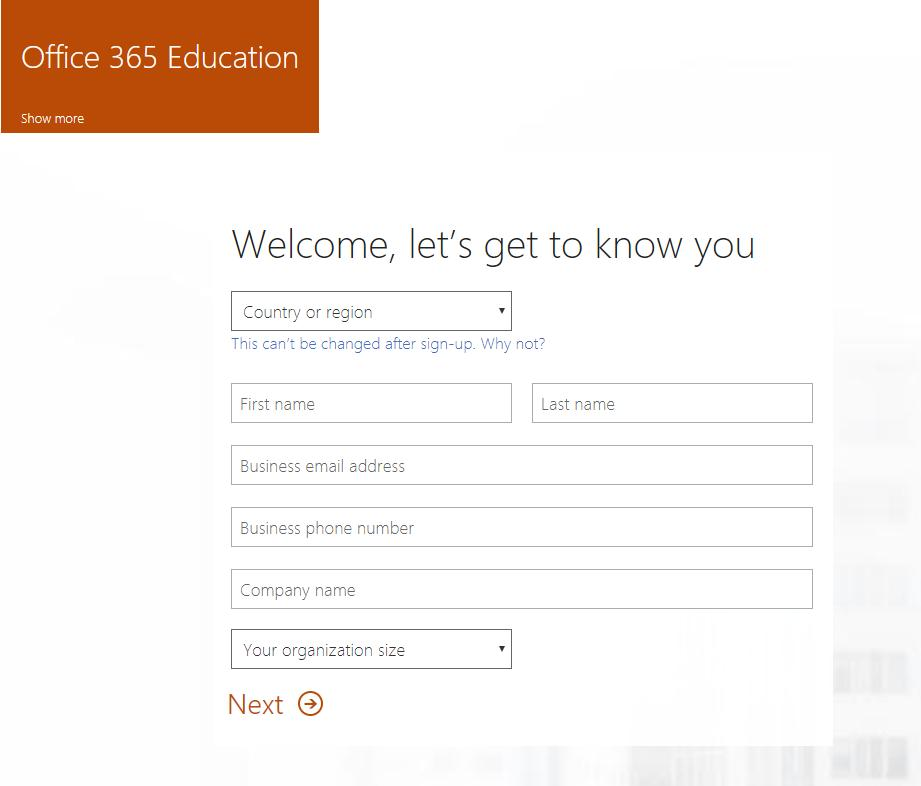

1. **Choose `United States`** for the Country/Region for your tenant (this determines the SDS Schema, and Datacenter deployment, **the sample data (below) does not work with all regions!**). Populate information about yourself and click `Next`.

    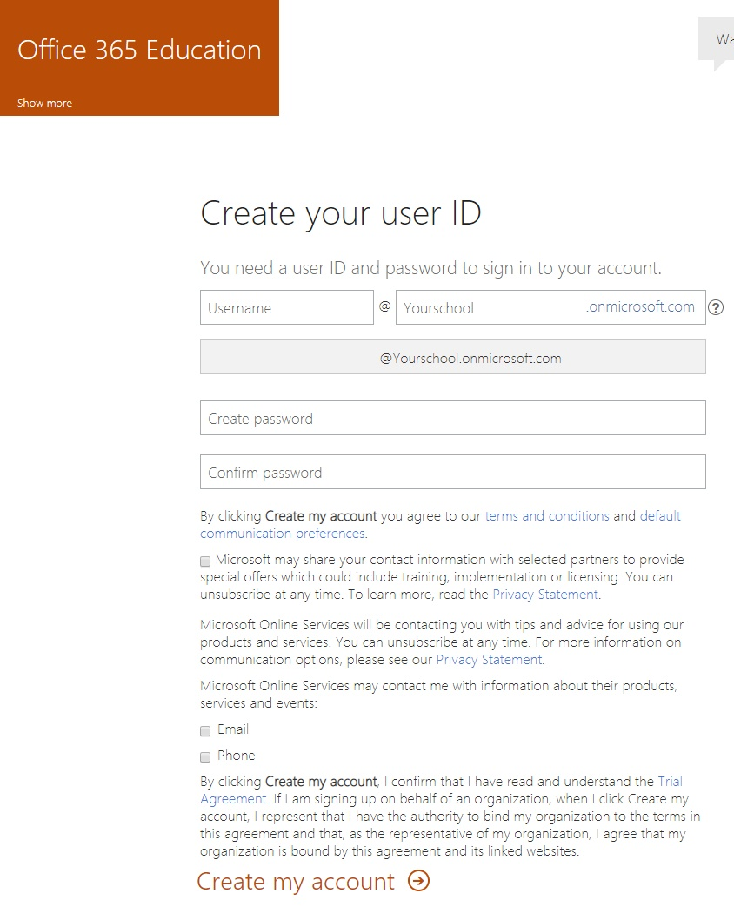

1. Create a user name and password for your company and click `Create my account`.

    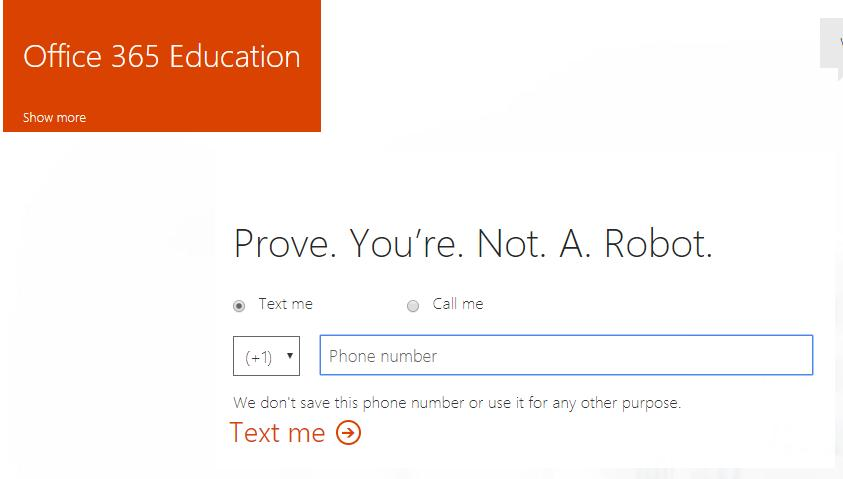
    
1. Enter you phone number, select your method of communication and click `Text me`.

    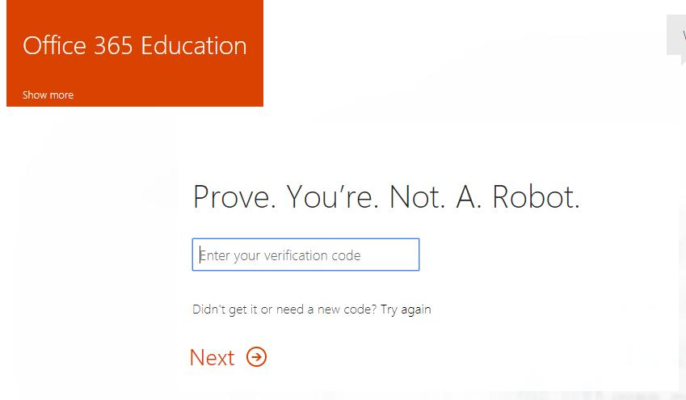

1. Once you receive your verification code, enter it and click `Next`.

    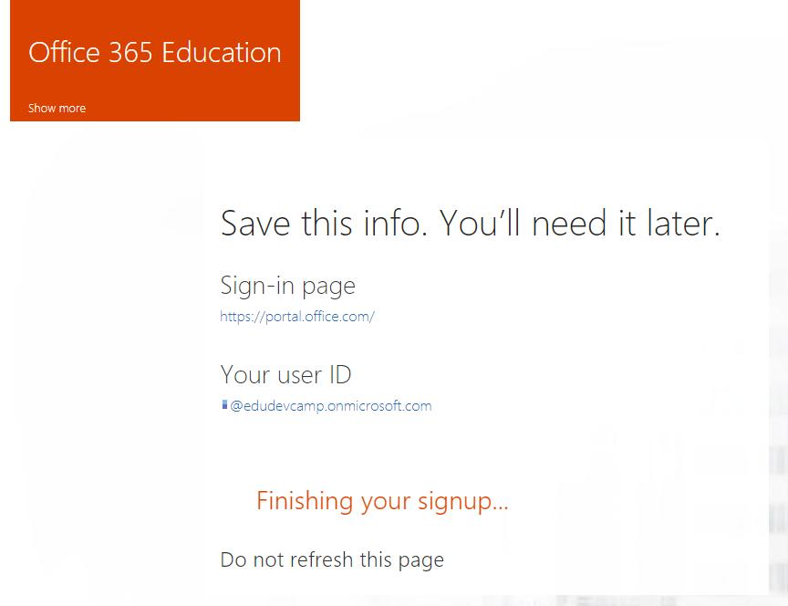

1. Wait for the setup to finish. Prior to moving forward, make sure to capture the displayed information in order to sign into your new account. Click `You're ready to go...`.

    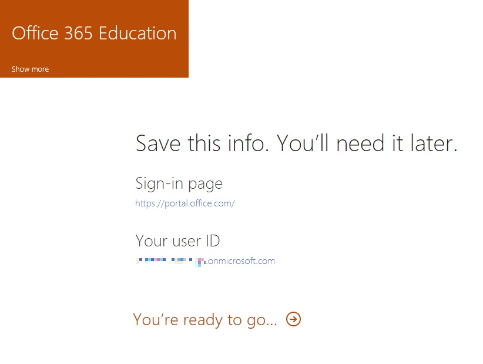

    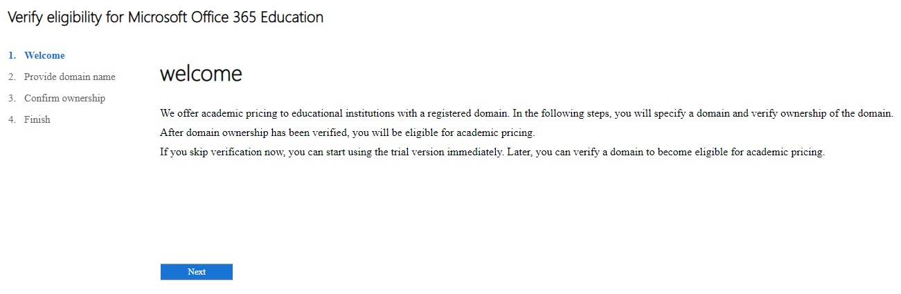

1. You will be redirected to the verification page. Since verification requires you to edit the DNS records of your domain and take some time just close the browser tab and browse to [sds.microsoft.com](https://sds.microsoft.com/Home/Dashboard). (Please note that the link to the SDS admin page will not appear in the Office 365 Admin center while your domain is not verified). It may take a few minutes before you can access the SDS page.

    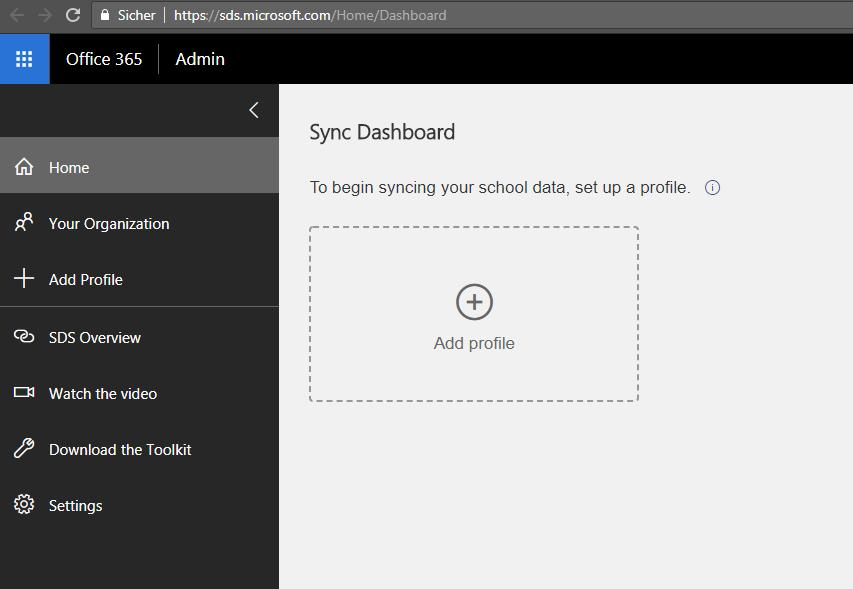
	
1. If you are unable to sign in to School Data Sync, you probably don't have a license attached to your user account yet.

    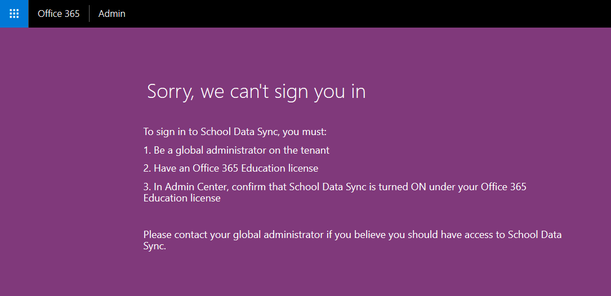

1. Go back to the [Office 365 Admin center](https://admin.microsoft.com/Adminportal/) and click `Users` > `Active users` in the menu and select your user account. In the row `Product licenses` click `Edit` and activate the `School Data Sync` license below `Office 365 A5 for faculty` and click `Save`.

    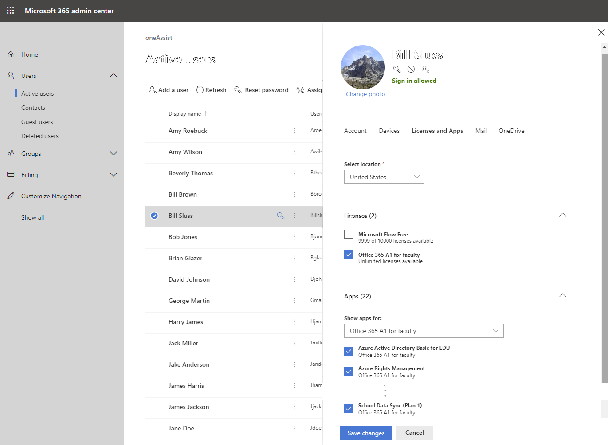

1. Now you should be able to access the SDS page. Click `Show more` > `Admin` > `Admin centers` > `School Data Sync` again. If you are still unable to sign in to SDS, sign out of the Office 365 Admin center and sign back in to try again.

[Back to top](#content)

---

## Exercise 2: Set up demo data in the School Data Sync Admin Portal

> Please note that if your Office 365 tenant is based in the UK, the required attributes for the CSV files containing the demo data will vary. For more detail go to [Required CSV files for School Data Sync](https://docs.microsoft.com/en-us/schooldatasync/csv-files-for-school-data-sync#required-csv-files-for-school-data-sync). For the purpose of this course please do not select `United Kingdom` as `Country or region` during [Exercise 1: Set up Office 365 Educational trial subscription](https://github.com/Microsoft/edu-devcamp/tree/master/HOL/HOL0#exercise-1-set-up-office-365-educational-trial-subscription). Should you select UK anyway, go to [Required CSV files for School Data Sync](https://docs.microsoft.com/en-us/schooldatasync/csv-files-for-school-data-sync#required-csv-files-for-school-data-sync) to download the CSV files in the UK format. The names of users and schools in your tenant will be different from those used in this training.

1. Download these CSV files containing the demo data: [School](./assets/School.csv), [Section](./assets/Section.csv), [Student](./assets/Student.csv), [Student Enrollment](./assets/StudentEnrollment.csv), [Teacher](./assets/Teacher.csv) and [Teacher Roster](./assets/TeacherRoster.csv). If you have downloaded the Dev Camp content you can find the files in the folder `HOL/HOL0/assets/`.

1. To access the School Data Sync Admin Portal launch a private web browser, navigate to [sds.microsoft.com](https://sds.microsoft.com), click `Sign-In`, then enter your O365 Global Admin account credentials.

1. After logging in, click `+ Add Profile` in the left hand navigation pane to create a `Sync Profile`.

    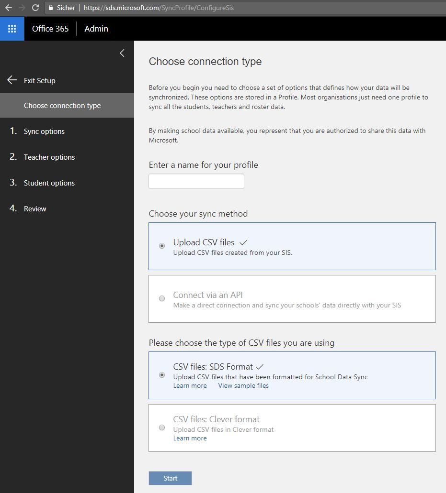

1. On the `Choose Connection Type` page, complete the form. Enter a name for your sync profile. This name will be used to identify the sync profile in the SDS Dashboard, and cannot be changed once the profile setup is complete. Select `Upload CVS files` and `CVS files: SDS Format`. Once complete, click `Start`. 

    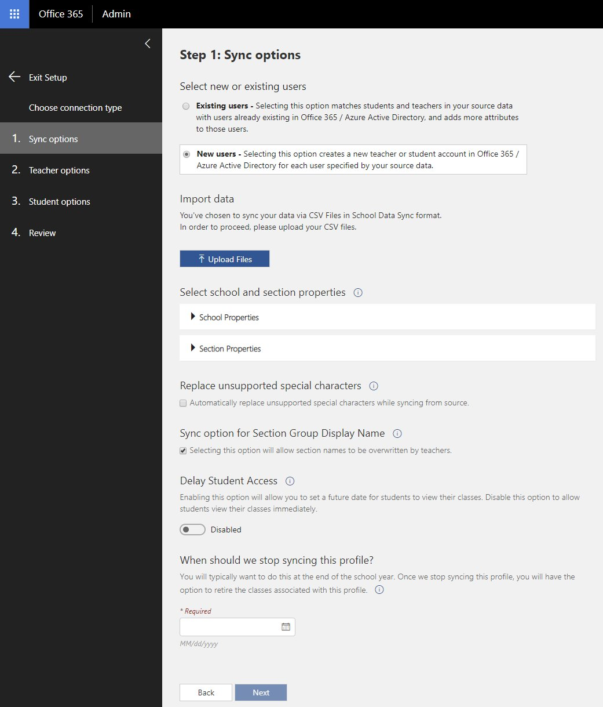

1. On the Sync Options page, select the  `new users` option. Then click upload files to upload your 6 CSV files. Once uploaded, select an arbitrary stop date in the future, click `Next`. In a production scenario you would usually choose to sync existing users. For a more detailed instruction on the sync process see [docs.microsoft.com/en-us/SchoolDataSync/how-to-deploy-school-data-sync-by-using-csv-files](https://docs.microsoft.com/en-us/SchoolDataSync/how-to-deploy-school-data-sync-by-using-csv-files).

    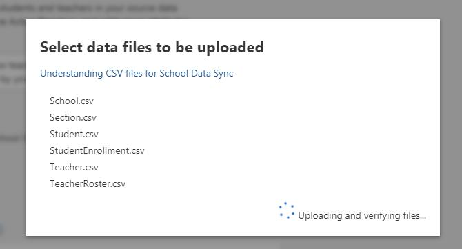

1. On the `Teacher options` page make sure that `faculty` licenses are selected and click `Next`.

    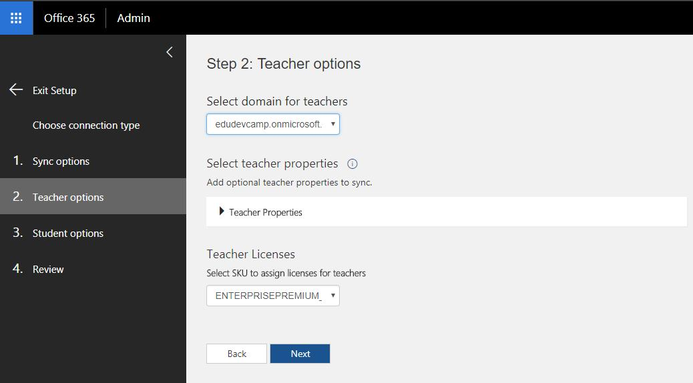

1. On the `Student options` page make sure that `student` licenses are selected and click `Next`.

    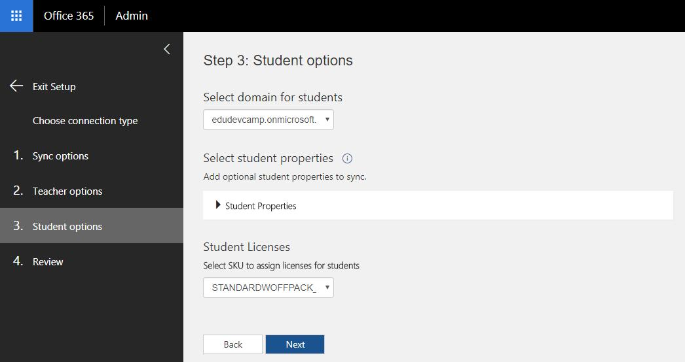

1. On the `Review page`, ensure you've made the appropriate selections. If no additional changes are needed, click `Create Profile`.

    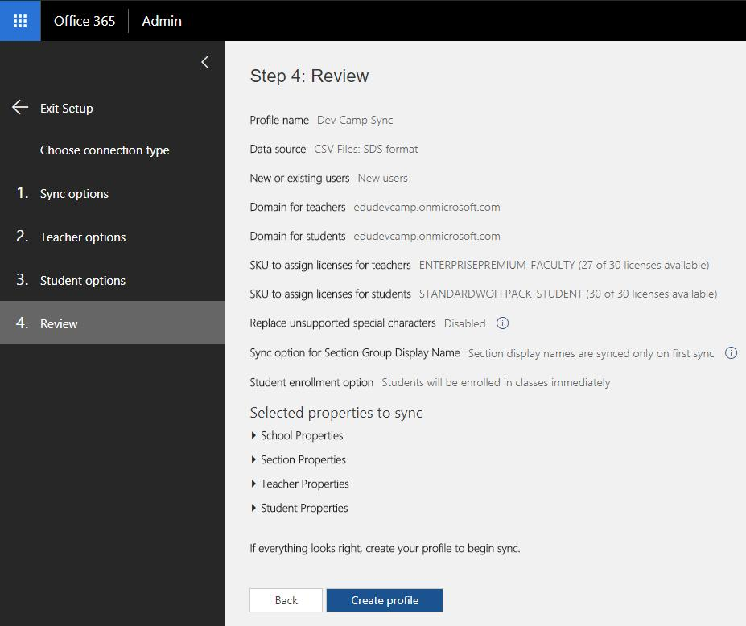

1. Once you create a sync profile, SDS will begin a pre-sync validation process. During this process, SDS will ensure there are no obvious errors with your CSV files. If any errors are found during the pre-sync validation process, you will have the option to fix them and re-upload the files before clicking the resume sync button and begin the real synchronization process. If you receive errors and choose not to update them, you can still choose to resume sync without fixing the errors. Just be aware that SDS can only sustain up to 15,000 errors before the profile will enter a quarantine status.

    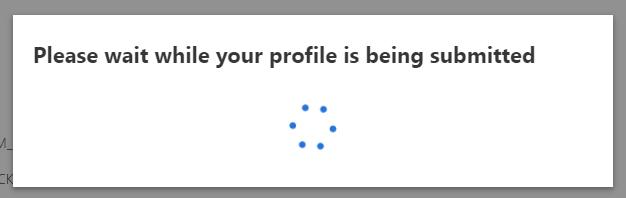

    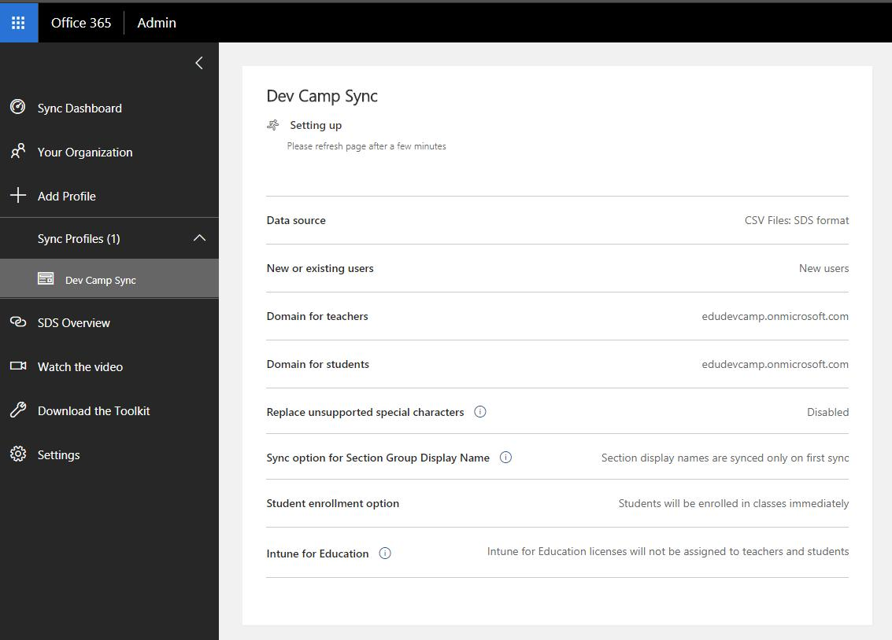

1. The sync process will take some time and you will be prompted to manually refresh the status page. Press `F5` to do so.

    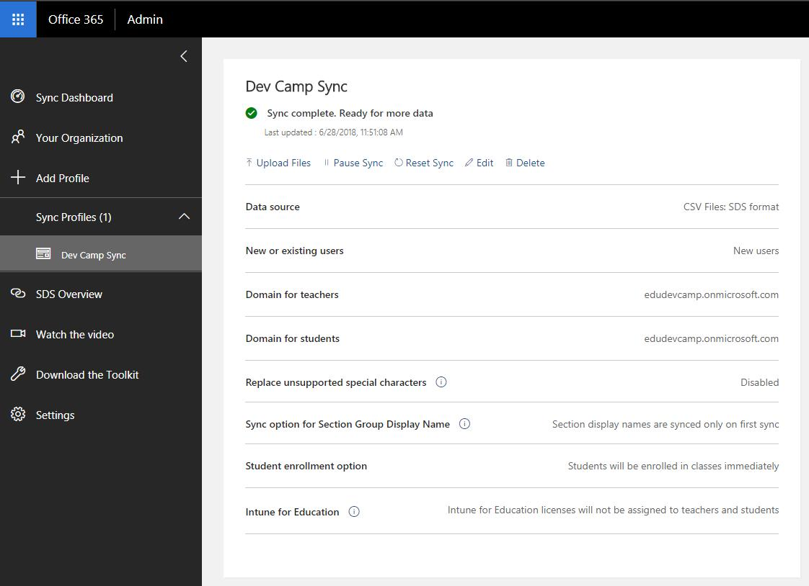

[Back to top](#content)

---

## Exercise 3: Set up Azure free trial subscription
The 30 day Azure free trial will be used in the hands-on labs to host content in Azure like the Progressive Web App or the Teams apps.

Setting up a Azure free trial requires a credit card for verification. If you do not have a credit card at hand and your trainer can provide you with an Azure Pass promo code skip to the next subsection.

### Free Trial (with credit card verification)

1. Open a InPrivate or Incognito browser window (`Ctrl + Shift + P` in Edge and Internet Explorer and Firefox or `Ctrl + Shift + N` in Google Chrome)
 and browse to [azure.microsoft.com/en-us/free](https://azure.microsoft.com/en-us/free/?ref=portal) and click the `Start free` button.

    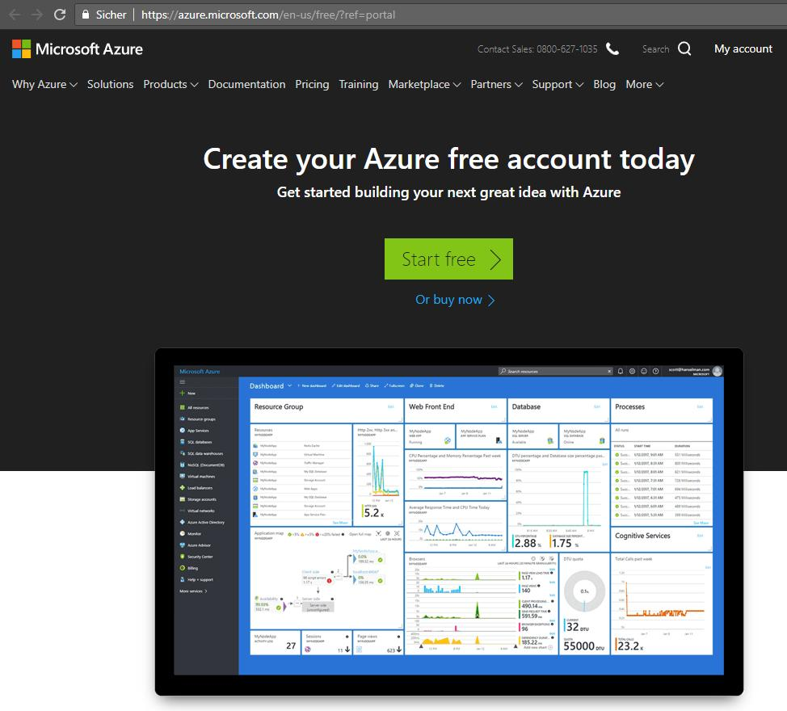

1. Complete the form and be sure to use the e-mail address you created in [Exercise 1](#ex1) for your Office 365 Educational trial subscription. **You will need a valid credit card in the third step** `Identity verification by card` **for the** `Country/Region` **you select here.** To continue, click `Next`.

    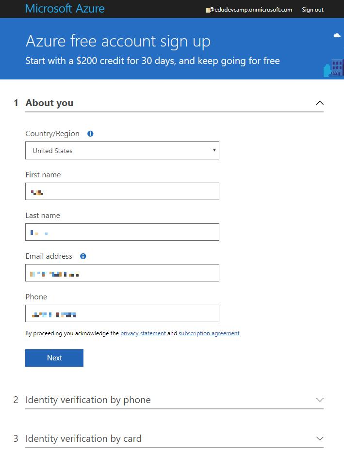

1. Enter your phone number and click `Text me`. Enter the verification code that you receive via SMS and click `Verify code`.

    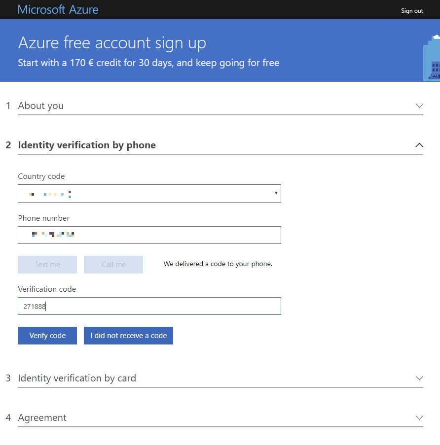

1. Enter your credit card details for additional verification. You credit card will **not** be charged. Agree to the terms and conditions and click `Sign up`.

    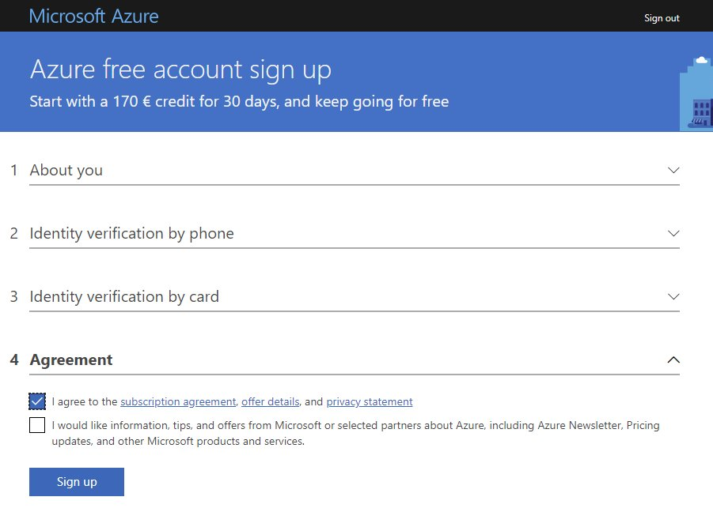

> If you want to start all over again to sign up for the Azure free trial, you can do so in the Azure portal. Sign in to https://portal.azure.com and select `Cost Management + Billing` from the navigation. Click `Subscriptions` in the menu and click `+ New subscription` at the top of the blade. On the next page select `Free trial` and start again with step 2. of [Exercise 3: Set up Azure free trial subscription](#ex3).

### Azure Pass (with promo code)

**Only continue if you skipped the previous section!**

1. Open a InPrivate or Incognito browser window (`Ctrl + Shift + P` in Edge and Internet Explorer and Firefox or `Ctrl + Shift + N` in Google Chrome)
 and browse to [microsoftazurepass.com](https://microsoftazurepass.com) and click the `Start` button.

    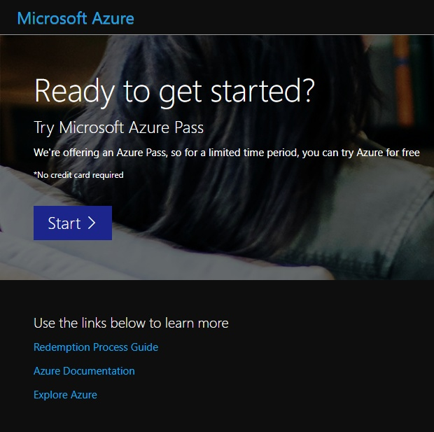

1. Make sure you are logged in with the new account you created in exercise 1 and click `Confirm Microsoft Account`.

    

1. Enter the promo code you received and click `Claim Promo Code`.

    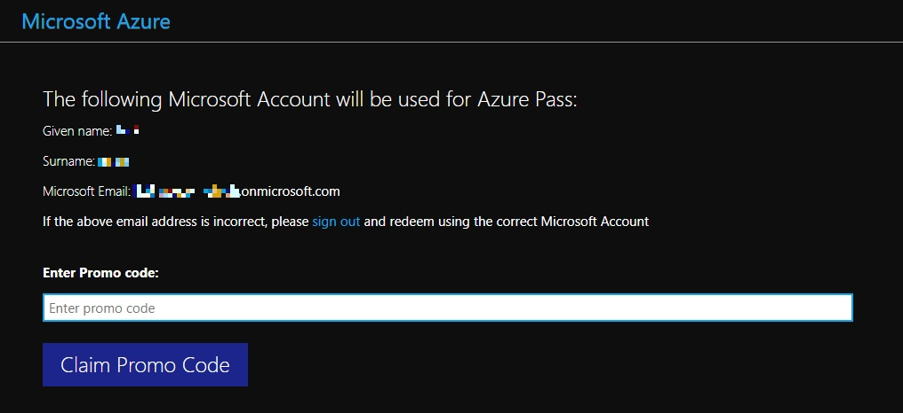

1. On the next screen confirm the information you entered in exercise 1 by clicking `Next`.

    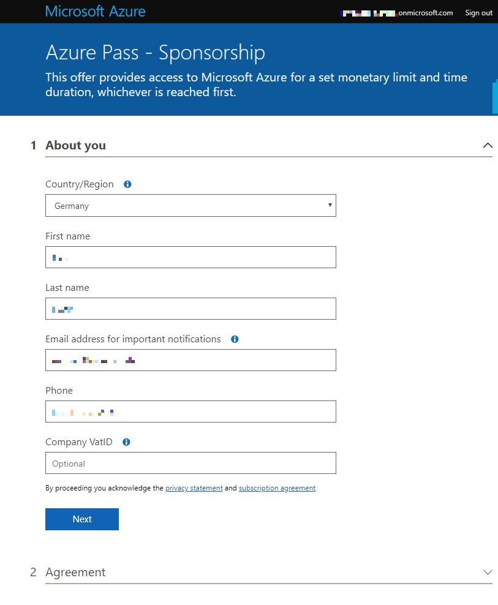

1. Check the `I agree...` statement and click `Sign up`.

    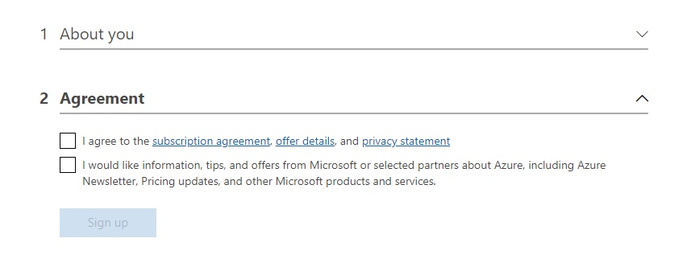
    
1. You will be redirected to the Azure portal.

[Back to top](#content)

---

## Exercise 4: Provision a virtual machine for development
To follow the programming examples in the upcoming hands-on labs you will need a machine running Microsoft Visual Studio. In this exercise you will provision a virtual machine in Azure that has Visual Studio 2017 already installed.

1. Open an InPrivate or Incognito browser window (`Ctrl + Shift + P` in Edge, Internet Explorer and Firefox or `Ctrl + Shift + N` in Google Chrome), browse to [portal.azure.com](https://portal.azure.com) and sign in using the e-mail address used in the previous exercise.

1. Click `Virtual machines` in the menu on the left.

    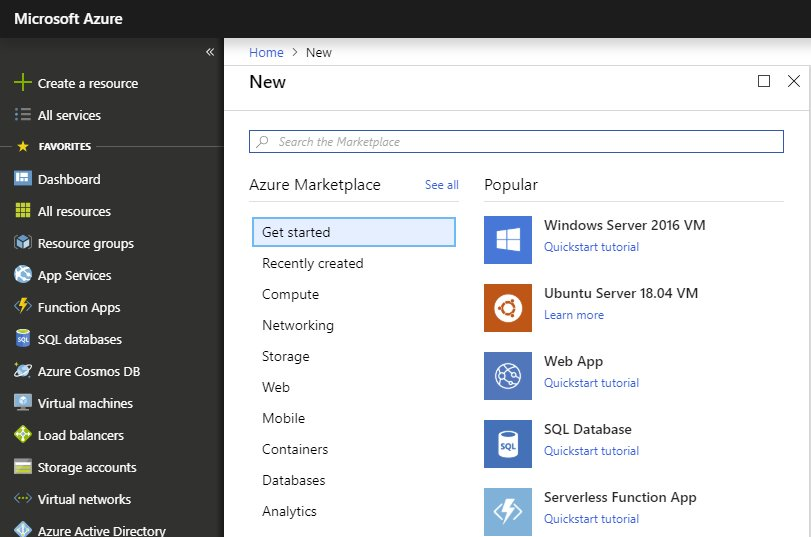

1. Click the `+ Add` button on the top menu.

1. Enter a `Virtual machine name`.

1. Then click `Browse all images and disks` below the `Image` dropdown.

1. Enter `Visual Studio Community 2017` in the search box.

1. From the results select `Visual Studio Community 2017 (latest release) on Windows 10 Enterprise (x64)` and click `Create` at the bottom of the page.

    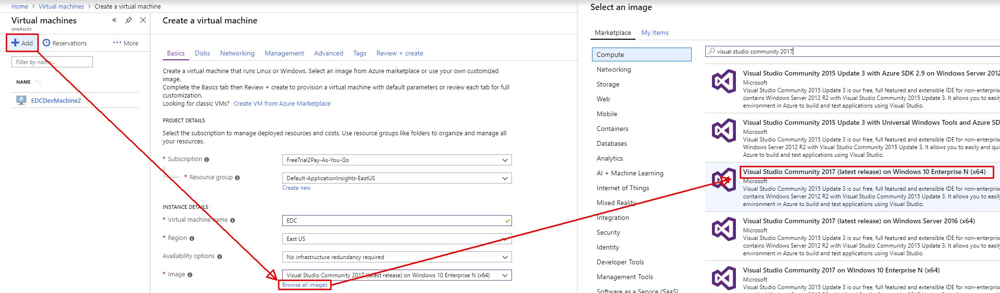

1. Under `Subscription`, use your free trial. Also assign a name to your virtual machine and to the resource group that will be created along with the virtual machine. Enter your username and choose a password. Then select `RDP` as the available inbound port. To continue, click `Management` at the top of the page.

    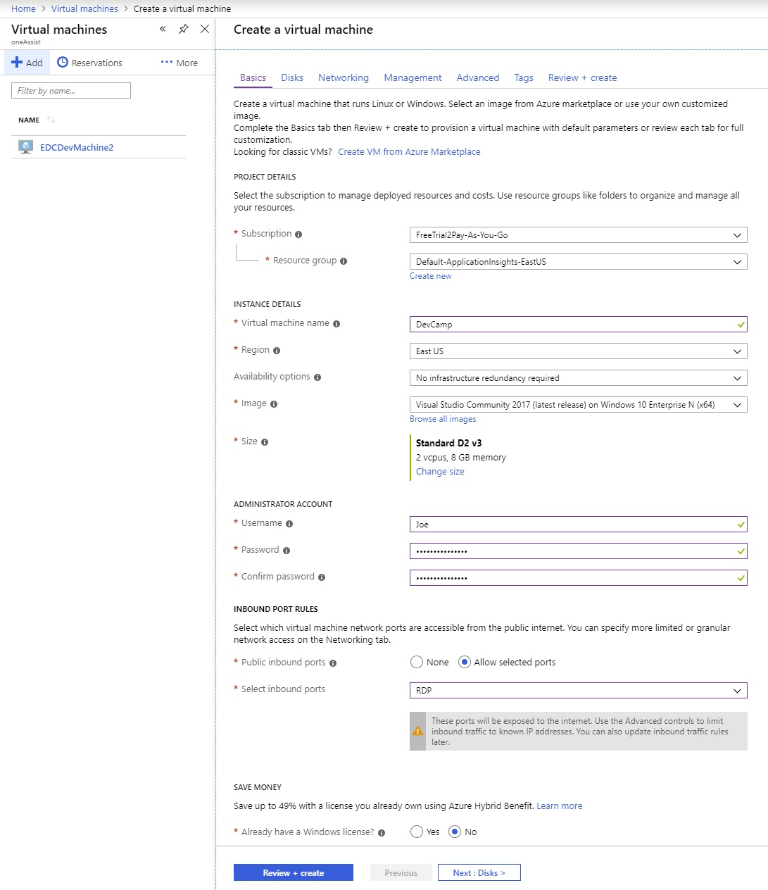

1. Disable all monitoring. Click `Review + create` at the bottom of the page.

    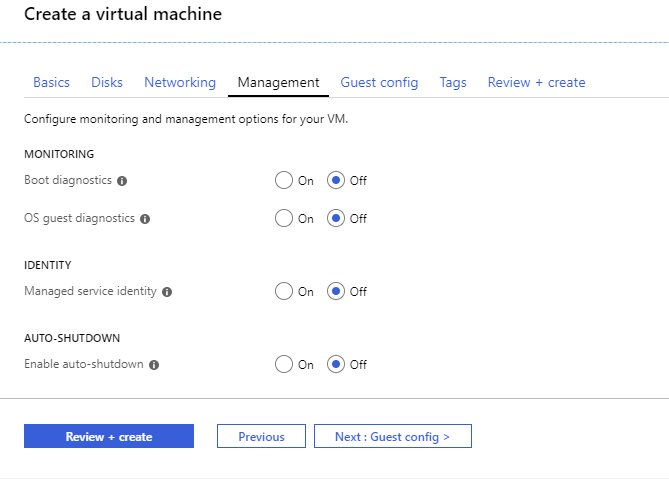

1. Review the summary. Click `Create` at the bottom of the page.

    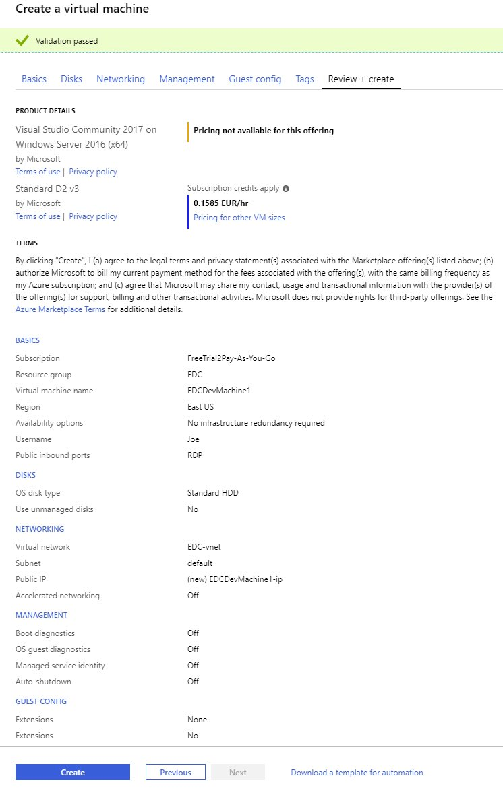

1. While the virtual machine is provisioned you will see a notification in the top menu bar.

    

1. You will also see a notification when the provisioning process has finished.

    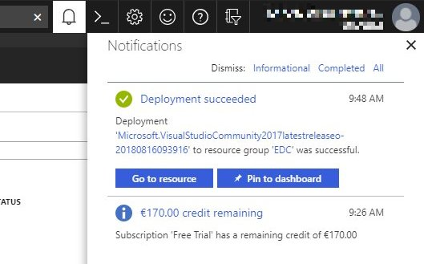

1. Click `Virtual machines` in the menu on the left and click on the newly created virtual machine.

    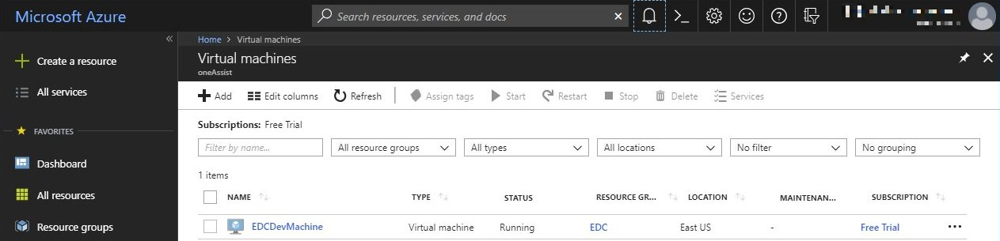

1. On the details page of the virtual machine click `Start` if it is not already running, then click `Connect`.

    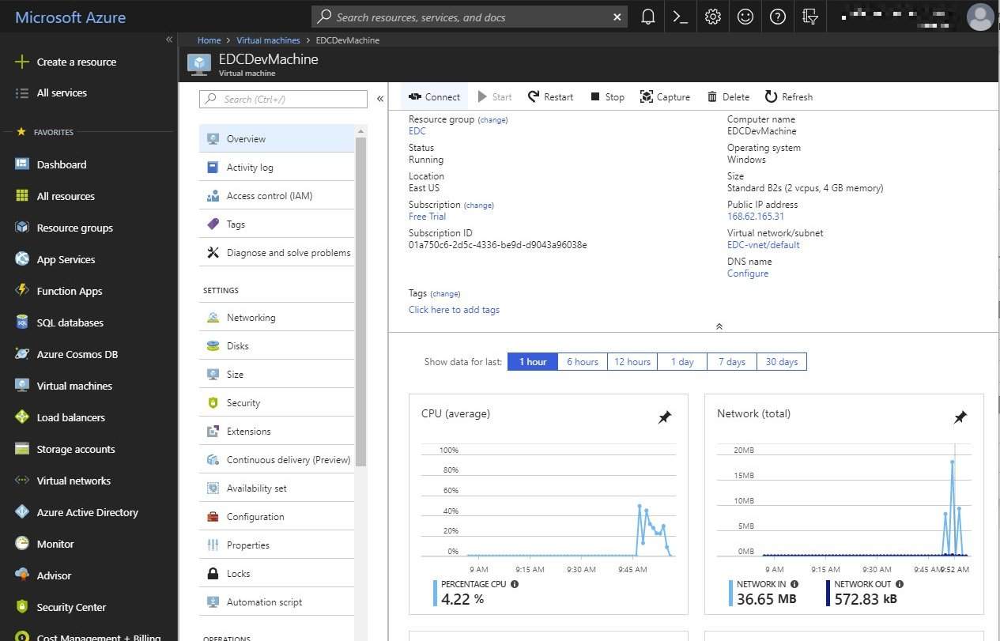

1. Use the `RDP` tab and click `Download RDP File`.

    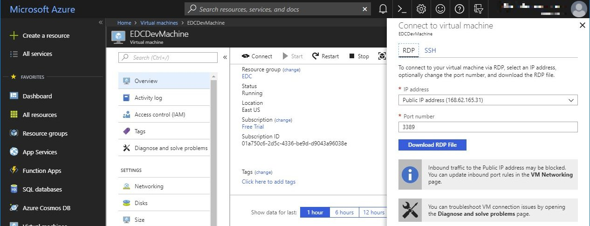

1. A remote desktop session will start. Enter the credentials you provided when setting up the virtual machine. Once you can see the desktop of Windows Server 2016 start Visual Studio 2017. Enter the credentials you used to create the Azure Free Trial to activate Visual Studio.

    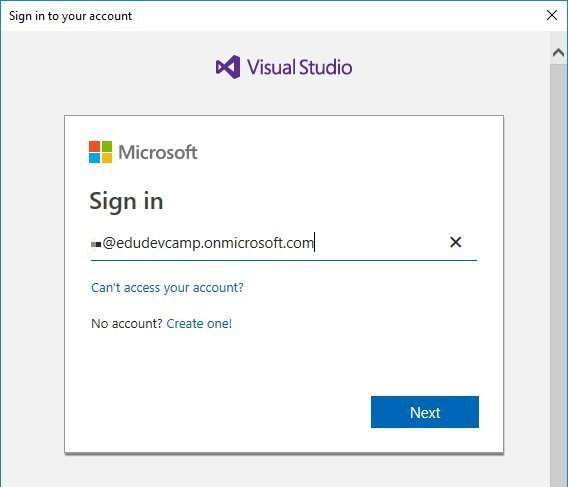

1. The exercises will prompt you to download several files. The pre-configured security settings do not allow downloads. Start the Internet Explorer. From the Tools menu, select `Internet Options`. In the Internet Options dialog box, click the `Security` tab. Click `Custom Level`. In the Security Settings dialog box, scroll to the `Downloads` section. Under `File download`, select `Enable`, and then click `OK`. In the confirmation dialog box, click `Yes`. Click `OK` > `Apply` > `OK`. If you want to debug web applications created in the hands-on labs you can download an alternative browser like [Chrome](https://www.google.com/chrome/).

Your virtual machine is now ready to use.

>&#x1F53A; Even though you chose the `latest release` VM there might be new updates available for Visual Studio 2017 which are now released in very short intervals. It is **not** necessary and recommended to install these! The updates are usually quite large and the installation will take time! Only update if a version **lower than 15.7.0** is installed (check `Help` -> `About Microsoft Visual Studio`)! &#x1F53A;

[Back to top](#content)

---

## Continue with lab 1

You are now ready to start hands-on lab 1. [View HOL 1 instructions](../HOL1).

[Back to top](#content)

---

Copyright 2018 Microsoft Corporation. All rights reserved. Except where otherwise noted, these materials are licensed under the terms of the MIT License. You may use them according to the license as is most appropriate for your project. The terms of this license can be found at https://opensource.org/licenses/MIT.