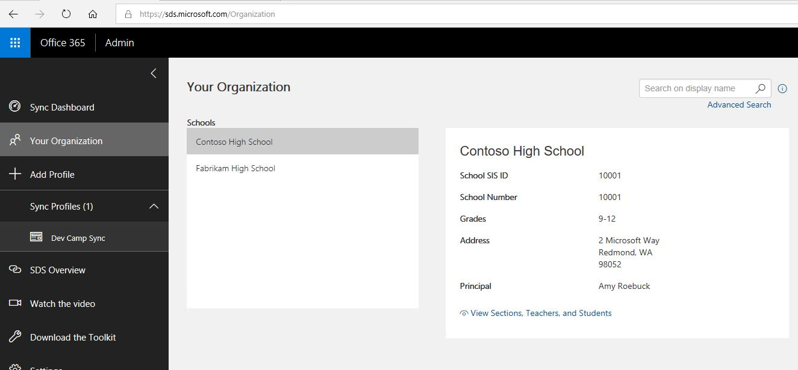
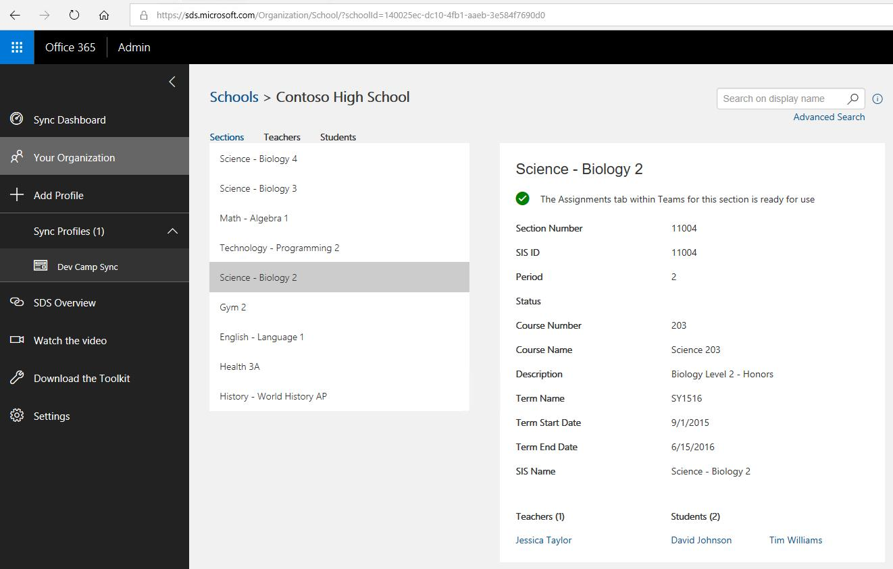
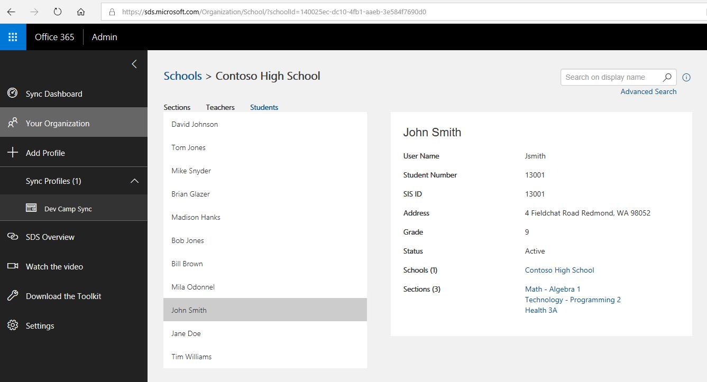
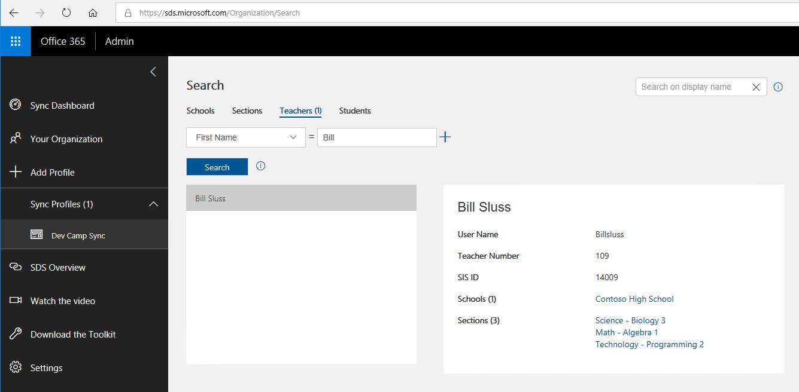
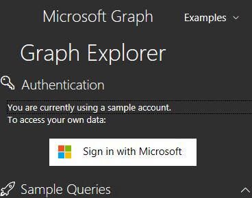
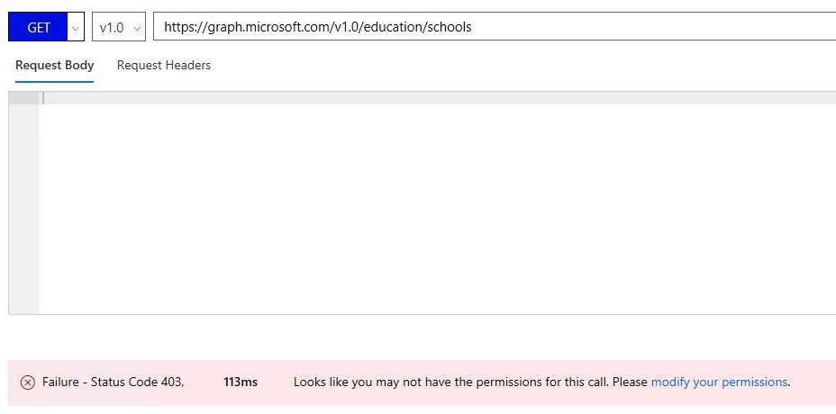
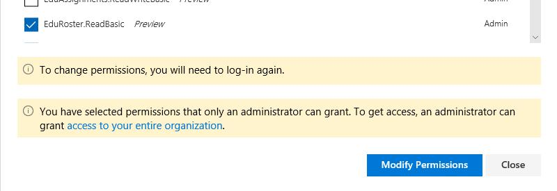
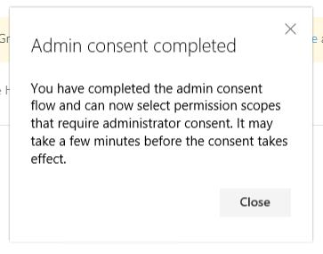
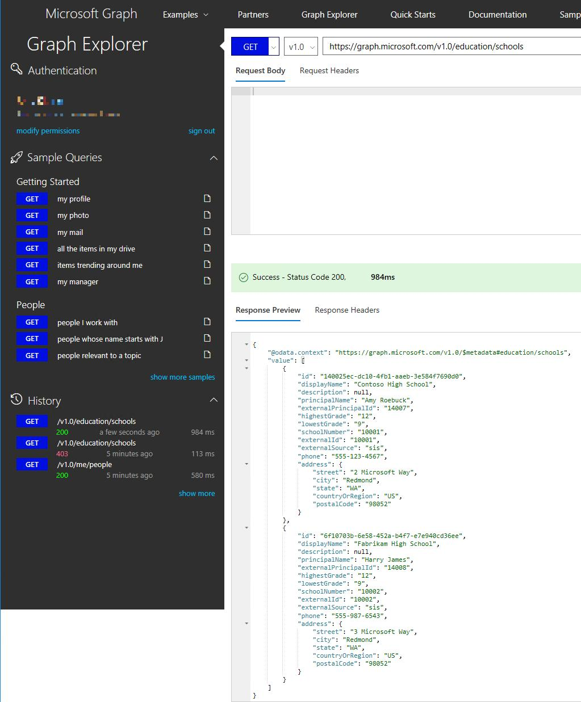
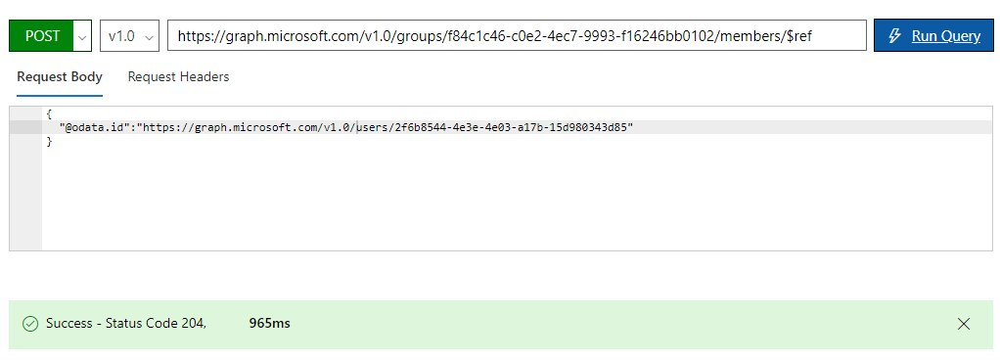

# Explore School Data Sync data

## Content
* [Overview](#overview)
* [Prerequisites](#prerequisites)
* [Exercise 1: Using SDS portal](#ex1)
* [Exercise 2: Using Graph Explorer](#ex2)
* [Continue with lab 2](#continue)

---

## Overview
In this lab, you will explore your School Data Sync demo data using web interfaces. You will learn about the Graph API which you can use to create applications that utilize the API to read and modify the data.

[Back to top](#content)

---

## Prerequisites

Complete [HOL 0](./../HOL0) to set up demo data in the School Data Sync Admin Portal.

[Back to top](#content)

---

## Exercise 1: Using SDS portal

In the previous hands-on-lab you created a sync to upload sample data to your School Data Sync Admin Portal. The portal lets you browse and query the synced data.

1. To access the School Data Sync Admin Portal launch a private web browser, navigate to [sds.microsoft.com](https://sds.microsoft.com), click `Sign-In`, then enter your O365 Global Admin account credentials.

1. After logging in, click `Your Organization` in the left hand navigation pane to see a list of your schools.

    

1. After selecting a school, click `View Sections, Teachers, and Students` below the school details to reach the sections overview.

    

1. Click `Teachers` to see the list of teachers. Select a teacher to see details.

    

1. Click `Students` to see the list of students. Select a student to see details.

    

1. Click `Advanced Search` to see created queries on your data. You can combine multiple criteria to filter your data.

    

[Back to top](#content)

---

## Exercise 2: Using Graph Explorer

When you want to utilize your data within your own applications you use the Microsoft Graph API. For example you can display information from SDS and Microsoft Teams in your application or automate common tasks like creating classes, adding students and assignments. Microsoft provides the online Graph Explorer so you can test the queries to the API before you implement them in your application.

1. To access the Graph Explorer launch a private web browser, navigate to [developer.microsoft.com/en-us/graph/graph-explorer](https://developer.microsoft.com/en-us/graph/graph-explorer), click `Sign in with Microsoft`, then enter your O365 Global Admin account credentials.

    

1. Access to the rostering API features requires that you grant corresponding permissions to the Graph Explorer app. When you execute a query that requires more permissions you will be prompted by the Graph Explorer.

    

1. Add permissions for `EduRoster.ReadBasic` and `Group.ReadWrite.All` and click `Modify Permissions`.

    

    You may have to wait for the permissions to update before you can execute all queries.

    

    There is a known issue with the Graph API where some queries return the status code 403 even though the appropriate permissions have been given. Currently there is no known workaround for this issue.

1. Enter `https://graph.microsoft.com/v1.0/education/schools` in the query field and click `Run Query` to fetch a list of your schools. Note how the query field auto-completes your queries.

    

1. Try more queries. You can find the API reference and more example queries at [developer.microsoft.com/en-us/graph/docs/api-reference/beta/resources/education-overview](https://developer.microsoft.com/en-us/graph/docs/api-reference/beta/resources/education-overview). Note that you currently can't test queries like [adding class members](https://developer.microsoft.com/en-us/graph/docs/api-reference/beta/api/educationclass_post_members) or [teachers](https://developer.microsoft.com/en-us/graph/docs/api-reference/beta/api/educationclass_post_teachers) using the Graph Explorer since it requires `EduRoster.ReadWrite.All` permissions which you can only grant to an app and not your test user accounts. But you can add them as a group member:

    1. Query `https://graph.microsoft.com/v1.0/groups/` to get a list of all groups including the classes. Note the id of classes `Science - Biology 2` and `Math - Algebra 1`.

    1. Query `https://graph.microsoft.com/v1.0/groups/<ID OF Science - Biology 2>/members/` to get a list of students in the `Science - Biology 2` class. Note the id of a students.

    1. Change the request method from `GET` to `POST`. Query `https://graph.microsoft.com/v1.0/groups/<ID OF Math - Algebra 1>/members/$ref` with `{ "@odata.id":"https://graph.microsoft.com/v1.0/users/2f6b8544-4e3e-4e03-a17b-15d980343d85" }` in the `Request Body` field. Make sure you add the [required permissions](https://developer.microsoft.com/en-us/graph/docs/api-reference/v1.0/api/group_post_members) to your own account.

        

    1. If you check the members of the `Math - Algebra 1` now you will see the added student in the list.

    Using the API it is possible to read and write roster information and even management of the School Data Sync. The Graph Explorer is a great tool to help you tweak your queries.

[Back to top](#content)

---

## Continue with lab 2

You are now ready to start hands-on lab 2. [View HOL 2 instructions](../HOL2).

[Back to top](#content)

---

Copyright 2018 Microsoft Corporation. All rights reserved. Except where otherwise noted, these materials are licensed under the terms of the MIT License. You may use them according to the license as is most appropriate for your project. The terms of this license can be found at https://opensource.org/licenses/MIT.