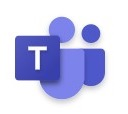
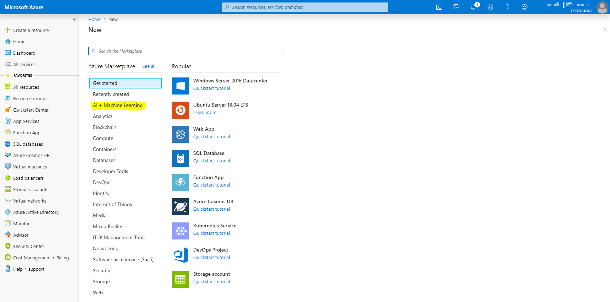
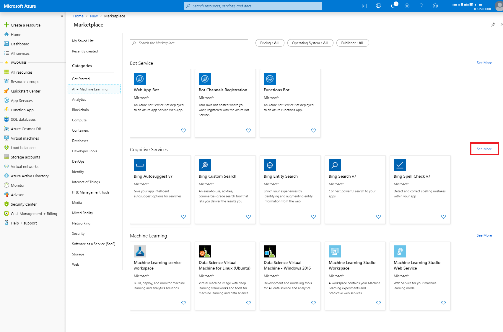
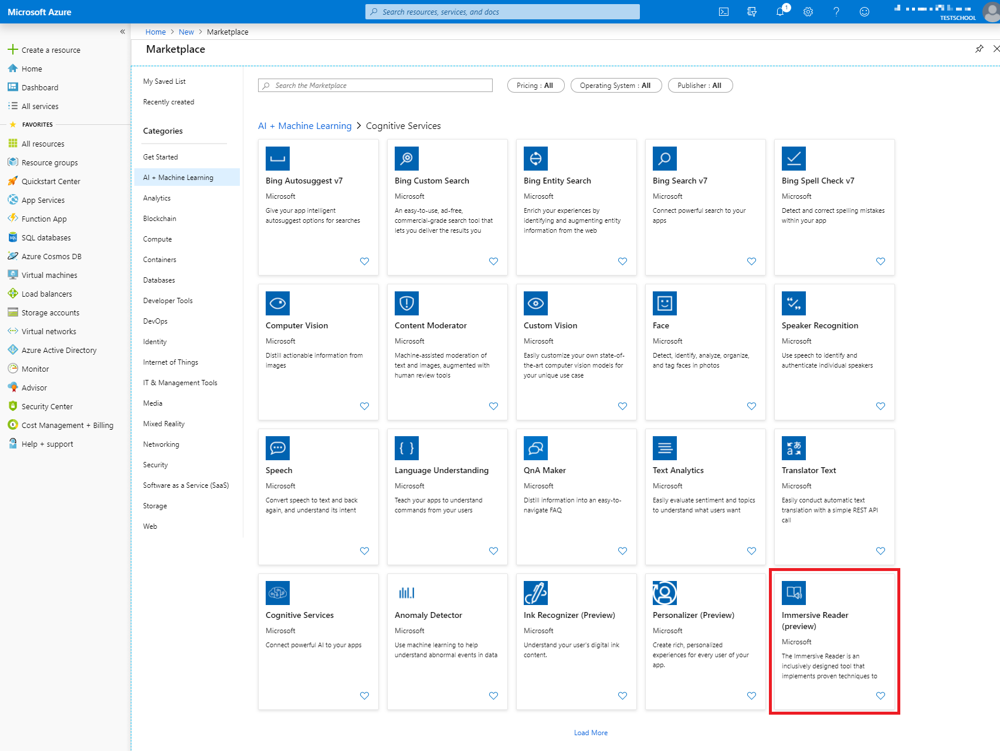
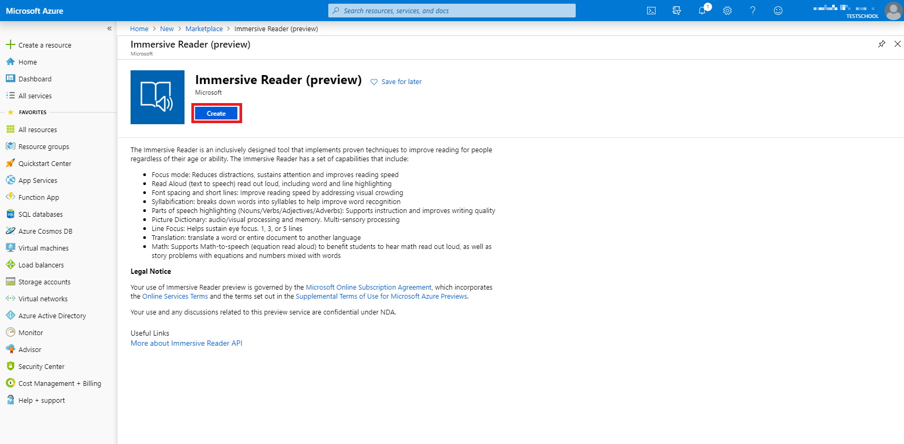
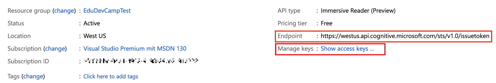
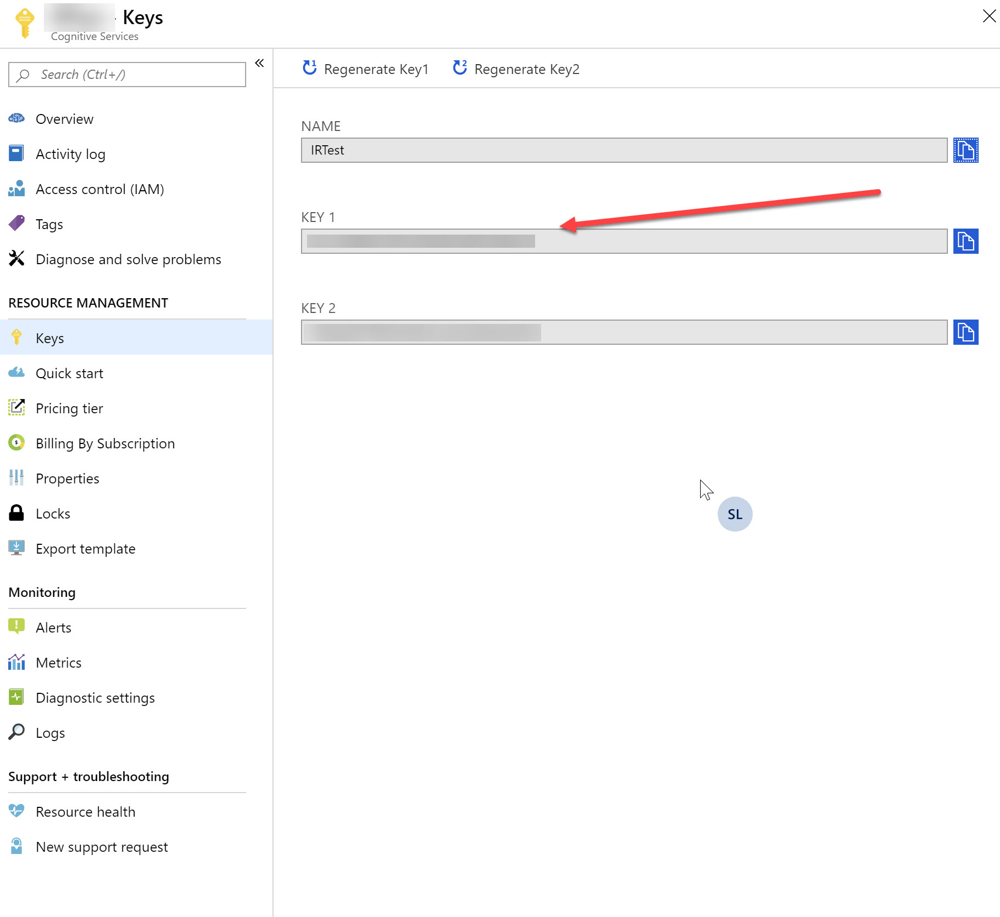

# Share to Teams and Immersive Reader

## Content<a name="content"></a>
* [Overview](#overview)
* [Prerequisites](#prerequisites)
* [Exercise 1: Create a web page and add the Share to Teams button](#ex1)
* [Exercise 2: Create a web page and add the Immersive Reader SDK](#ex2)

---

## Overview<a name="overview"></a>
In this lab, you will learn how to integrate the `Share to Teams` button and Immersive Reader SDK to your applications.

[Back to top](#content)

---

## Prerequisites<a name="prerequisites"></a>

* Complete [HOL 0](./../HOL0) to set up an Azure account.
* For the `Share to Teams` complete [HOL 2](./../HOL2) to install and configure the Microsoft Teams client.
* For the Immersive Reader install [Node.js](https://nodejs.org) and Yarn.

[Back to top](#content)

---

## Exercise 1: Create a web page and add the Share to Teams button<a name="ex1"></a>

Third-party websites can use the launcher script to embed `Share to Teams` buttons on their webpages which will launch the `Share to Teams` experience in a popup window when clicked. This will allow you to share a link directly to any person or Microsoft Teams channel without switching context.


1. Open Visual Studio and click `File` -> `New` -> `File...`.

    

1. Select `HTML Page` from `General` and click `Open`.

    

1. You will see a static HTML5 template. First, you'll need to add the `launcher.js` script in the header section on your webpage.

    ```html
    <script async defer src="https://teams.microsoft.com/share/launcher.js"></script>
    ```

1. Add some decorating content to the body of the page:

    ```html
    <div>
      <h1>Learn about Lorem Ipsum!</h1>
      <p>Lorem ipsum dolor sit amet, consectetuer adipiscing elit. Maecenas porttitor congue massa. Fusce posuere, magna sed pulvinar ultricies, purus lectus malesuada libero, sit amet commodo magna eros quis urna. Nunc viverra imperdiet enim. Fusce est. Vivamus a tellus. Pellentesque habitant morbi tristique senectus et netus et malesuada fames ac turpis egestas. Proin pharetra nonummy pede. Mauris et orci. Aenean nec lorem.</p>
      <p>In porttitor. Donec laoreet nonummy augue. Suspendisse dui purus, scelerisque at, vulputate vitae, pretium mattis, nunc. Mauris eget neque at sem venenatis eleifend. Ut nonummy. Fusce aliquet pede non pede. Suspendisse dapibus lorem pellentesque magna. Integer nulla. Donec blandit feugiat ligula. Donec hendrerit, felis et imperdiet euismod, purus ipsum pretium metus, in lacinia nulla nisl eget sapien.</p>
      <p>Donec ut est in lectus consequat consequat. Etiam eget dui. Aliquam erat volutpat. Sed at lorem in nunc porta tristique. Proin nec augue. Quisque aliquam tempor magna. Pellentesque habitant morbi tristique senectus et netus et malesuada fames ac turpis egestas. Nunc ac magna. Maecenas odio dolor, vulputate vel, auctor ac, accumsan id, felis. Pellentesque cursus sagittis felis.</p>
    </div>
    <h2>Share your knowledge in Teams!</h2>
    ```

1. Next, add an HTML element on your webpage with the `teams-share-button` class attribute and the link to share in the `data-href` attribute. This sample links to the Bing homepage, usually you want to link to the page you are currently seeing.

    ```html
    <div
        class="teams-share-button"
        data-href="https://www.bing.com" >
    </div>
    ```

    This will add the Microsoft Teams icon to your website.

    

    Optionally, if you want a different icon size for the Share-to-Teams button, use the `data-icon-px-size` attribute.

    ```html
    <div
        class="teams-share-button"
        data-href="https://www.bing.com"
        data-icon-px-size="64" >
    </div>
    ```

    If you know that the URL preview from your link to be shared won't render well in Teams (for example the link would require user authentication) you can disable the URL preview by adding the `data-preview` attribute set to `false`.

    ```html
    <div
        class="teams-share-button"
        data-href="https://www.bing.com"
        data-preview="false" >
    </div>
    ```

    If your page dynamically renders content, you can use the the `shareToMicrosoftTeams.renderButtons()` method to force the share button to render at the appropriate place in the pipeline.

1. Save the HTML file to your hard disk. Then open the HTML file with a browser by double-clicking it and click on the Teams icon at the end of the page. This will open a new window with the sharing preview (you may have to login with your Teams account first to be redirected to the preview page). Select a team or channel and click the `Share` button.

    

### Crafting your website preview

When your website is shared to Teams, the card that is inserted into the selected channel will contain a preview of your website. You can control the behavior of this preview by ensuring the appropriate meta-data is added to the website being shared (the data-href URL). The table below outlines the necessary tags. You can use either the HTML default versions, or the Open Graph version.

In order for the preview to be displayed you must:

- Include either a Thumbnail image, or both a Title and Description (for best results, include all three).
- The URL being shared cannot require authentication. If it does you can still share it, but the preview will not be created.

Value | Meta tag | Open Graph
------------ | ------------- | -------------
Title | `<meta property="title" content="Example Page Title">` | `<meta property="og:title" content="Example Page Title">`
Description | `<meta name="description" content="Example Page Description">` | `<meta property="og:description" content="Example Page Description">`
Thumbnail Image | none  | `<meta property="og:image" content="http://example.com/image.jpg">`

### Share to Teams for Education

For teachers using the `Share to Teams` button you will be given an additional option to create an assignment. This enables you to quickly create an assignment in the chosen Team based on the shared link.


[Back to top](#content)

---

## Exercise 2: Create a web page and add the Immersive Reader SDK<a name="ex2"></a>

The Immersive Reader is an inclusively designed tool that implements proven techniques to improve reading comprehension for emerging readers, language learners, and people with learning differences such as dyslexia.

You can use the Immersive Reader in your web application by using the Immersive Reader SDK.

### Create and subscribe to  Cognitive Service account in the Azure portal

1. Open a InPrivate or Incognito browser window (`Ctrl + Shift + P` in Edge and Internet Explorer and Firefox or `Ctrl + Shift + N` in Google Chrome) and browse to [portal.azure.com](https://portal.azure.com/) and sign in. Select `Create new resource` in the menu blade. In the `New` blade select `AI + Machine Learning` from the `Azure Marketplace`.

    

1. If you don't see the `Immersive Reader` service, click on `See More` to view the entire catalog of `Cognitive Services` APIs.

    

1. Select `Immersive Reader (preview)` from the list of `Cognitive Services`. Click `Load More` at the bottom of the page if you don't see the service.

    

1. Continue by clicking `Create` in the `Immersive Reader (preview)` blade.

    

1. In the `Create` blade, provide the following information:

    

    Field | Description
    ------------ | -------------
    **Name** | A descriptive name for your cognitive services resource. We recommend using a descriptive name, for example MyNameIRAPIAccount.
    **Subscription** | Select one of your available Azure subscriptions.
    **Location** | The location of your cognitive service instance. Different locations may introduce latency, but have no impact on the runtime availability of your resource.
    **Pricing tier** | The cost of your Cognitive Services account depends on the options you choose and your usage. For more information, see the API pricing details.
    **Resource group** | The Azure resource group that will contain your Cognitive Services resource. You can create a new group or add it to a pre-existing group.

### Create a Node.js web app with Express and add the Immersive Reader SDK

1. Create a Node.js web app with the `express-generator` tool. Open a terminal window, browse to a folder you want to use for this exercise and execute these three commands:

    ```bash
    npm install express-generator -g
    express --view=pug immersivereader
    cd immersivereader
    ```

    Your web app has been created in the `immersivereader` folder.

1. Go to [yarnpkg.com](https://yarnpkg.com/lang/en/docs/install/#windows-stable), download and install yarn. Install `yarn` dependencies, and add dependencies `request` and `dotenv`, which will be used later in this exercise by executing the following commands next:

    ```bash
    yarn
    yarn add request
    yarn add dotenv
    ```

1. Next, write a backend API to retrieve an access token using your subscription key. You need your subscription key and endpoint for this next step. You can find that information in the `Immersive Reader` resource in the Azure Portal.

    

    

    Once you have your subscription key and endpoint, create a new text file called `.env` in your `immersivereader` folder by creating the new text file and using the `rename` command in the terminal window. Paste the following code into it, replacing `{YOUR_SUBSCRIPTION_KEY}` and `{YOUR_ENDPOINT}` with your subscription key and endpoint, respectively.

    ```
    SUBSCRIPTION_KEY={YOUR_SUBSCRIPTION_KEY}
    ENDPOINT={YOUR_ENDPOINT}
    ```

    Be sure not to commit this file into source control, as it contains secrets that should not be made public.

1. Next, open the `app.js` file and add the following line to the top of the file. This loads the subscription key and endpoint as environment variables into Node.

    ```js
    require('dotenv').config();
    ```

1. Open the `routes\index.js` file and the following import at the top of the file:

    ```js
    var request = require('request');
    ```

1. Next, add the following code block directly below the line with `var router = express.Router();`. The code will create an API endpoint that acquires an access token using your subscription key, and then returns that token.

    ```js
    router.get('/token', function(req, res, next) {
        request.post({
            headers: {
                'Ocp-Apim-Subscription-Key': process.env.SUBSCRIPTION_KEY,
                'content-type': 'application/x-www-form-urlencoded'
            },
            url: process.env.ENDPOINT
        },

        function(err, resp, token) {
            return res.send(token);
        });
    });
    ```

    This API endpoint should be secured behind some form of authentication (for example, OAuth); that work is beyond the scope of this tutorial.

1. Open `views\layout.pug`, and add the following code under the `head` tag, before the `body` tag. These script tags load the Immersive Reader SDK and jQuery.

    ```pug
    script(src='https://contentstorage.onenote.office.net/onenoteltir/immersivereadersdk/immersive-reader-sdk.preview.js')
    script(src='https://code.jquery.com/jquery-3.3.1.min.js')
    ```

1. Open `views\index.pug`, and replace its content with the following code. This code populates the page with some sample content, and adds a button that launches the Immersive Reader.

    ```pug
    extends layout

    block content
      h2(id='title') Geography
      p(id='content') The study of Earth's landforms is called physical geography. Landforms can be mountains and valleys. They can also be glaciers, lakes or rivers.
      div(class='immersive-reader-button' data-button-style='iconAndText' data-locale='en-US' onclick='launchImmersiveReader()')
      script.
        function launchImmersiveReader() {
          // First, get a token using our /token endpoint
          $.ajax('/token', { success: token => {
            // Second, grab the content from the page
            const content = {
            title: document.getElementById('title').innerText,
            chunks: [ {
              content: document.getElementById('content').innerText + '\n\n',
              lang: 'en'
            } ]
            };

            // Third, launch the Immersive Reader
            ImmersiveReader.launchAsync(token, null, content);
          }});
        }
    ```

1. Your web app is now ready. Start the app by running the following command in the terminal window:

    ```bash
    npm start
    ```

1. Open your browser and navigate to `http://localhost:3000`. You should see the above content on the page. Click the Immersive Reader button to launch the Immersive Reader with your content.

### Specify the language of the Immersive Reader interface

By default, the language of the Immersive Reader interface matches the browser's language settings. You can also specify the language of the Immersive Reader interface with the following code.

1. In `views\index.pug`, replace the call to `ImmersiveReader.launchAsync(token, null, content)` with the code below.

    ```js
    const options = {
        uiLang: 'de',
    }
    ImmersiveReader.launchAsync(token, null, content, options);
    ```

1. Navigate to `http://localhost:3000`. When you launch the Immersive Reader, the interface will be shown in German.

### Launch the Immersive Reader with math content

You can include math content in the Immersive Reader by using [MathML](https://developer.mozilla.org/en-US/docs/Web/MathML).

1. Modify `views\index.pug` to include the following code above the call to `ImmersiveReader.launchAsync`:

    ```js
    const mathML = '<math xmlns="http://www.w3.org/1998/Math/MathML" display="block"> \
        <munderover> \
            <mo>∫</mo> \
            <mn>0</mn> \
            <mn>1</mn> \
        </munderover> \
        <mrow> \
            <msup> \
            <mi>x</mi> \
            <mn>2</mn> \
            </msup> \
            <mo>ⅆ</mo> \
            <mi>x</mi> \
        </mrow> \
        </math>';

        content.chunks.push({
        content: mathML,
        mimeType: 'application/mathml+xml'
    });
    ```

1. Navigate to `http://localhost:3000`. When you launch the Immersive Reader and scroll to the bottom, you'll see the math formula.

[Back to top](#content)

---

Copyright 2019 Microsoft Corporation. All rights reserved. Except where otherwise noted, these materials are licensed under the terms of the MIT License. You may use them according to the license as is most appropriate for your project. The terms of this license can be found at https://opensource.org/licenses/MIT.
