# Microsoft Teams

## Content
* [Overview](#overview)
* [Prerequisites](#prerequisites)
* [Exercise 1: Set up Microsoft Teams](#ex1)
* [Exercise 2: Create a new team](#ex2)
    * [Create a team](#ex2a)
    * [Create a Class Notebook](#ex2b)
    * [Create an Assignment](#ex2c)
* [Exercise 3: View demo data as teacher and student](#ex3)
* [Exercise 4: Create a Teams app](#ex4)
* [Continue with lab 4](#continue)

---

## Overview
In this lab, you will set up Microsoft Teams on your system, create your first team and create a custom Teams app hosted in Microsoft Azure.

[Back to top](#content)

---

## Prerequisites

* Complete [HOL 0](./../HOL0) to set up demo data in the School Data Sync Admin Portal.

[Back to top](#content)

---

## Exercise 1: Set up Microsoft Teams

1. Open a InPrivate or Incognito browser window (`Ctrl + Shift + P` in Edge and Internet Explorer and Firefox or `Ctrl + Shift + N` in Google Chrome)
 and browse to [teams.microsoft.com](https://teams.microsoft.com/). Click `Downloads` and select `Desktop (Windows 7+)` and click `DOWNLOAD NOW (64-BIT)`.

    

1. Execute the downloaded installer and when prompted login with your O365 Global Admin account credentials.

    

1. After the installation finished, complete the welcome wizard.

    

[Back to top](#content)

---

## Exercise 2: Create a new team

### Create a team

1. On the menu on the left click `Teams` and then click the `Create team` button in the center.

    

1. Select `Classes` as the team type.

    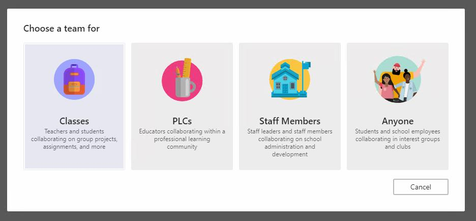

1. Enter a `Name` for your team.

    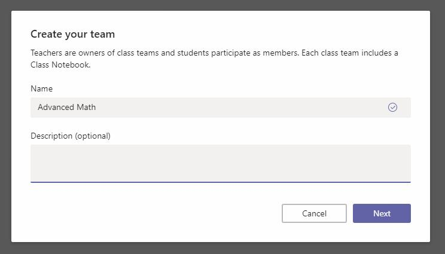

1. Find some students by entering a letter in the search box and add them to your team by clicking the names and clicking `Add`.

    

### Create a Class Notebook

1. Click `Set up Class Notebook`.

    

1. Follow the wizard by clicking `Next`.

    

1. Keep all the preselected features and click `Create`.

    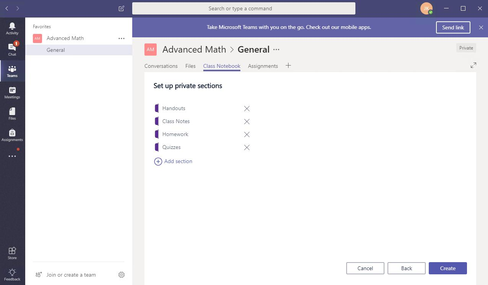

1. Wait for the wizard to finish.

    

### Create an Assignment

1. Go to the team's `Assignment` tab and click `Create` and `+ New assignment`.

    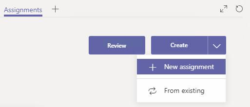

1. Enter all required fields and click `Save`.

    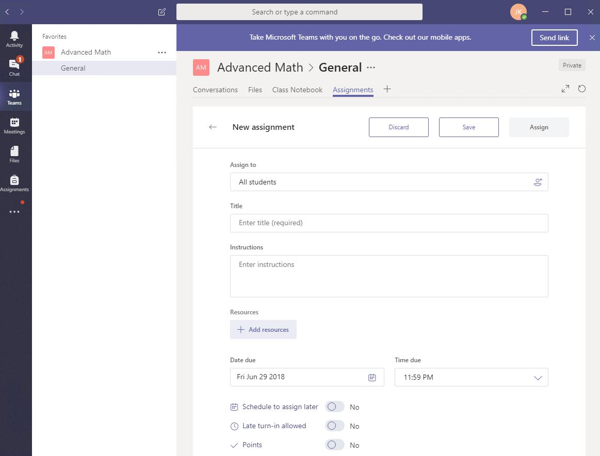

1. The assignment has been added to your list of assignments.You can edit it by clicking it.

    

You have manually created an assignment for your class. In a later hands-on-lab you will create assignments automatically.

[Back to top](#content)

---

## Exercise 3: View demo data as teacher and student
To see the demo data you created in [HOL 0](./../HOL0) you have to use Teams as one of the created users that have classes assigned to them. Please be aware that classes will be added to teams and are visible to students as soon as a teacher for that class logs into teams. To log in as a teacher or student you will need to know their login names.

1. Launch a private web browser, navigate to [admin.microsoft.com/AdminPortal](https://admin.microsoft.com/AdminPortal/) and sign in using your O365 Global Admin account credentials. Click `Users`.

    

1. Click `Active users`.

    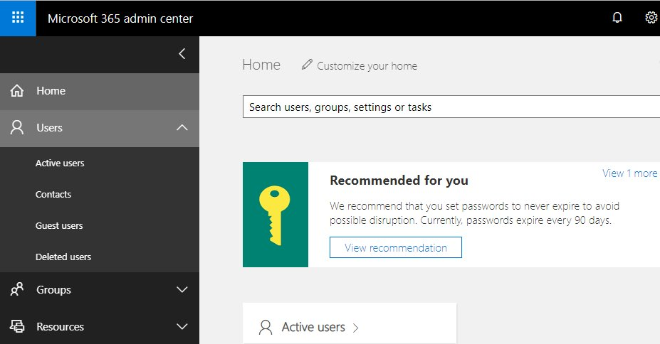

1. `Bill Sluss` teaches the `Technology - Programming 2` class. Click his name.

    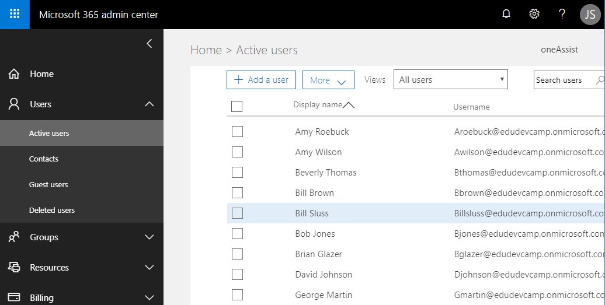

1. You can see the classes Bill teaches as group memberships. His username is `billsluss@yourdomain.onmicrosoft.com`.

    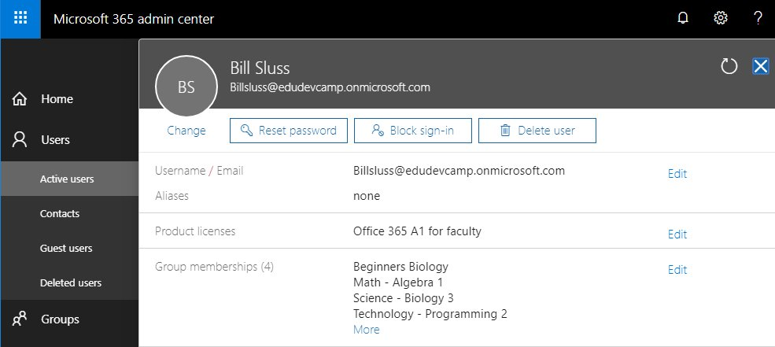

1. Return to the list of active users and repeat the process for one of Bill's students in the `Technology - Programming 2` class: `Jane Doe`.

1. Start the Teams client. Click the initials of the logged in user in the upper right corner and select `Sign out`.

    

1. Teams will automatically restart and display the login dialog. Login as `Bill Sluss` (`billsluss@yourdomain.onmicrosoft.com`) using the password `P@ssword`.

    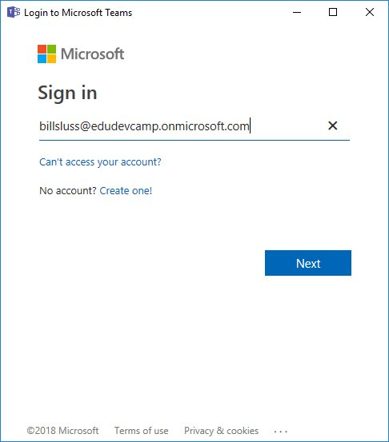

1. Note the classes in the list of teams that Bill teaches. Select `Technology - Programming 2` and create a new assignment.

    

    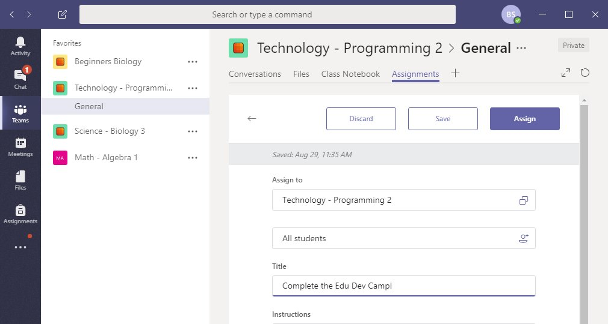

    

1. Log out and log in again as `Jane Doe` (`jdoe@yourdomain.onmicrosoft.com`), again using the password `P@ssword`.

    

1. Note that the `Technology - Programming 2` class and the assignment show up for the student.

    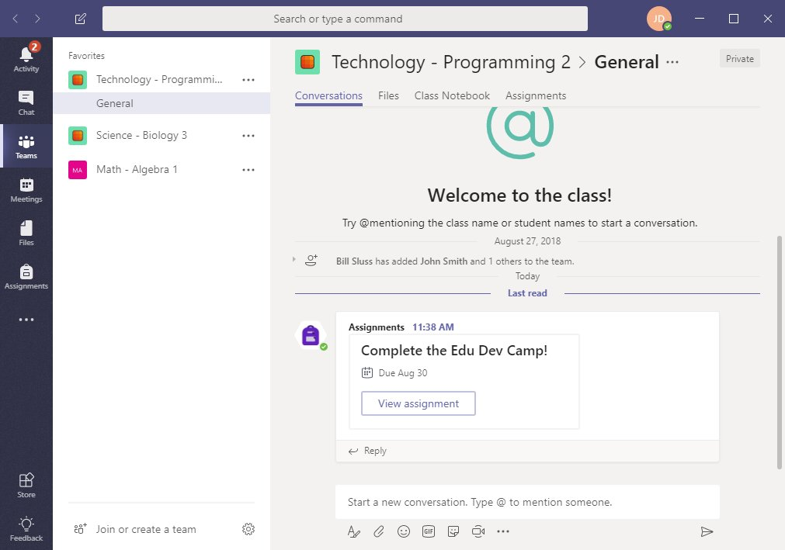

[Back to top](#content)

---

## Exercise 4: Create a Teams app

### Write your app

1. ...

### Host your app in Azure

You need the Azure trial subscription created in HOL 0.

ARM Script to create app? Besser alles von Hand machen. DEV VM: Visual Studio Community 2017 on Windows 10 Enterprise N (x64)

Microsoft Azure lets you host your Node.js web application on a free tier using shared infrastructure. This will be sufficient to run this sample. You can quickly host your app using the Azure Cloud Shell found on the Microsoft Azure Dashboard.

1. Open a InPrivate or Incognito browser window (`Ctrl + Shift + P` in Edge and Internet Explorer and Firefox or `Ctrl + Shift + N` in Google Chrome)
 and browse to [teams.microsoft.com](https://portal.azure.com/). Select the `Cloud Shell` button on the menu in the upper-right corner of the Azure portal. This will open the Cloud Shell at the bottom of the screen.

    

1. A resource group is a logical container into which Azure resources like web apps, databases, and storage accounts are deployed and managed. In the Cloud Shell, create a resource group with the command below. The command creates a resource group named `eduDevCampResourceGroup` in the West Europe location. To see all supported locations for App Service in `Free` tier, run the `az appservice list-locations --sku FREE` command. You generally create your resource group and the resources in a region near you. 

    `
    az group create --name eduDevCampResourceGroup --location "West Europe"
    `

    When the command finishes, a JSON output shows you the resource group properties.

1. In the Cloud Shell, create an App Service plan with the command below.

    `
    az appservice plan create --name eduDevCampAppServicePlan --resource-group eduDevCampResourceGroup --sku FREE
    `

1. In the Cloud Shell, create a web app in the myAppServicePlan App Service plan with the az webapp create command. 

1. Deploy ZIP file

1. Browse to the app

### Allow external apps in Teams

You must configure your Office 365 to allow Teams the use of external apps (that you uploaded yourself).

1. Open a InPrivate or Incognito browser window (`Ctrl + Shift + P` in Edge and Internet Explorer and Firefox or `Ctrl + Shift + N` in Google Chrome)
 and browse to [portal.office.com](https://portal.office.com) and enter your O365 Global Admin account credentials. 

1. Click `Services & add-ins` and select `Microsoft Teams`.

    

1. Expand the `Apps` section .

    

1. Check `Allow external apps in Microsoft Teams` and `Allow sideloading of external apps` and `Enable new external apps by default`. Click `Save`.

    

### Install App Studio

1. In Microsoft Teams click `Store` which can be found on the bottom left.

    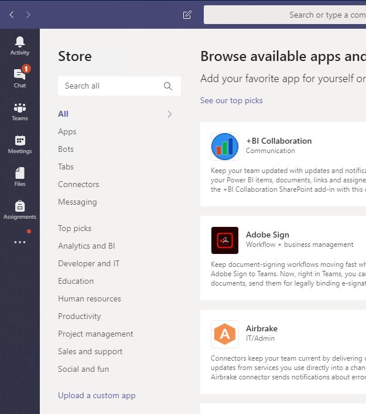

1. Use the search to find `App Studio`.

    

1. Select `App Studio` and click `Install`.

    

### Create an app manifest file

App Studio will create the manifest file for your new app. It also provides ready to use controls for your user interface.

1. Click `Open` next to `App`.

    

1. On the welcome screen click `Create a new app`.

    

1. Provide details for all fields. Click `Generate` to generate a new App ID. Download the two icon files from the [assets](./assets) folder: [tabapp192.png](./assets/tabapp192.png) and [tabapp32.png](./assets/tabapp32.png). Upload them in the `Branding` section.

    

1. After you have completed the `Details` -> `App details` page click `Capabilities` -> `Tabs` on the left hand menu to go to the next page. Click the `Add` button below `Team tab`.

    

1. ...

1. ...

### Upload and test your new tab

1. ...

[Back to top](#content)

---

## Continue with lab 4

You are now ready to start hands-on lab 4. [View HOL 4 instructions](../HOL4).

[Back to top](#content)

---

Copyright 2018 Microsoft Corporation. All rights reserved. Except where otherwise noted, these materials are licensed under the terms of the MIT License. You may use them according to the license as is most appropriate for your project. The terms of this license can be found at https://opensource.org/licenses/MIT.