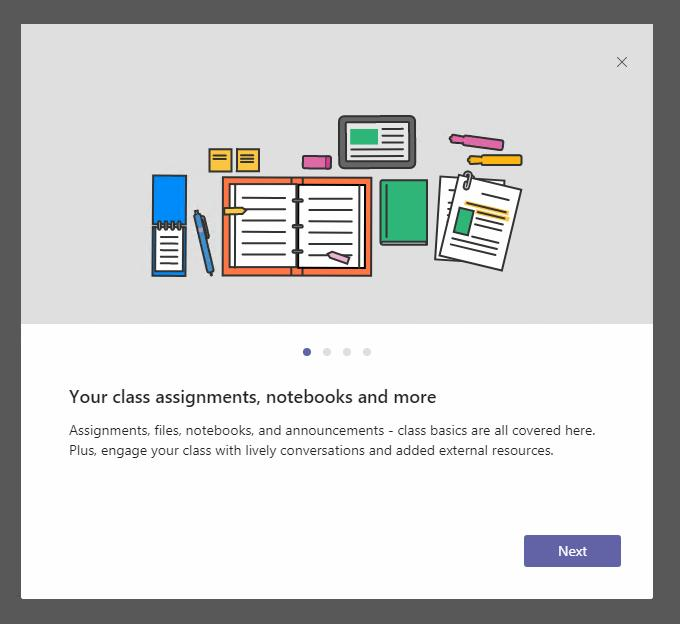
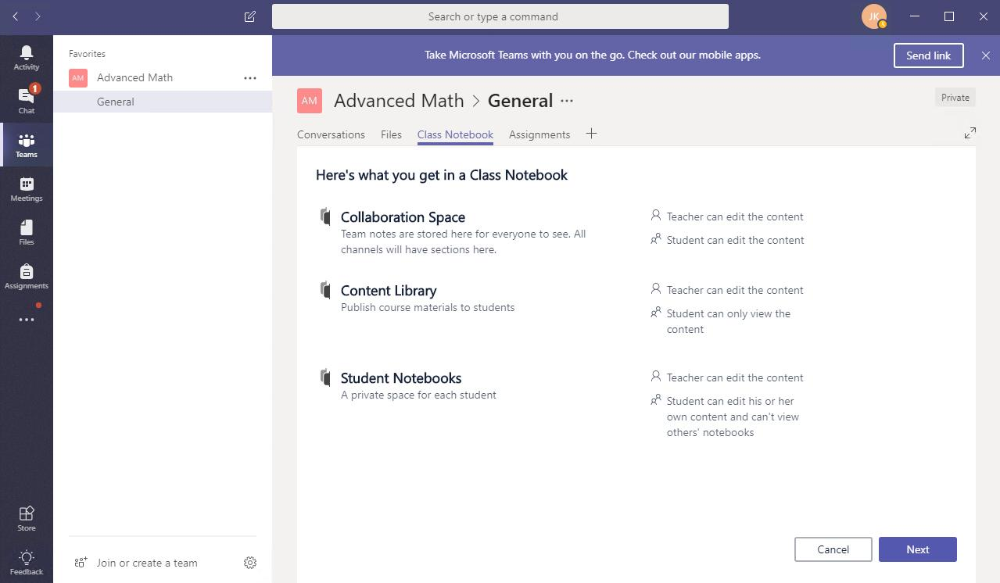
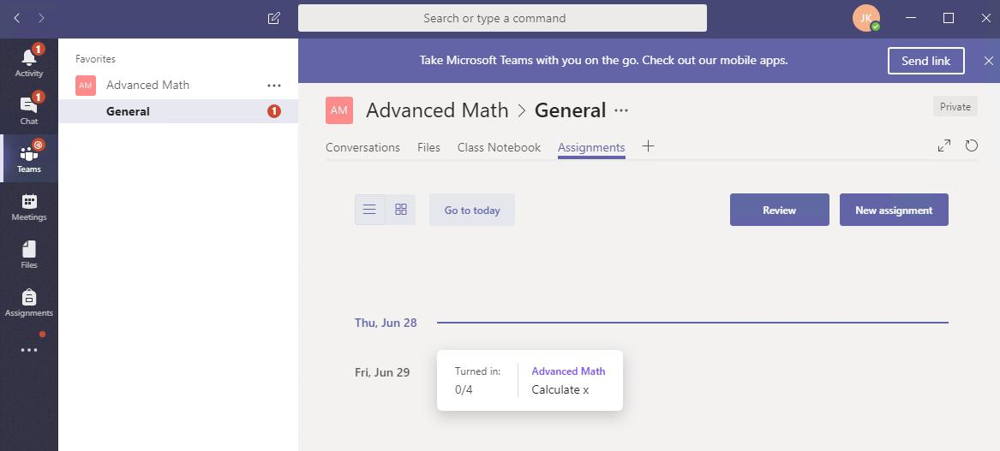
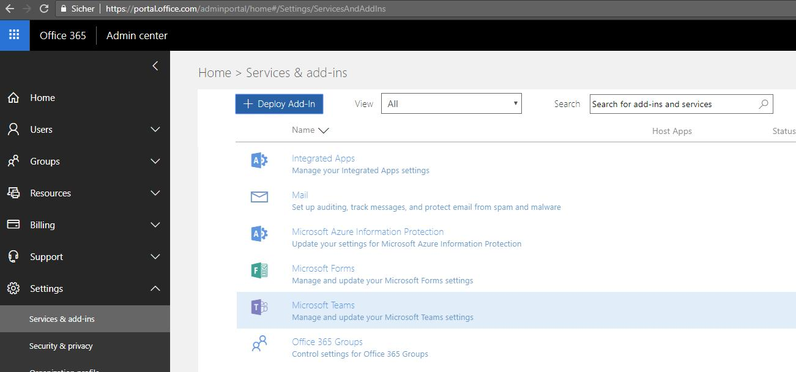
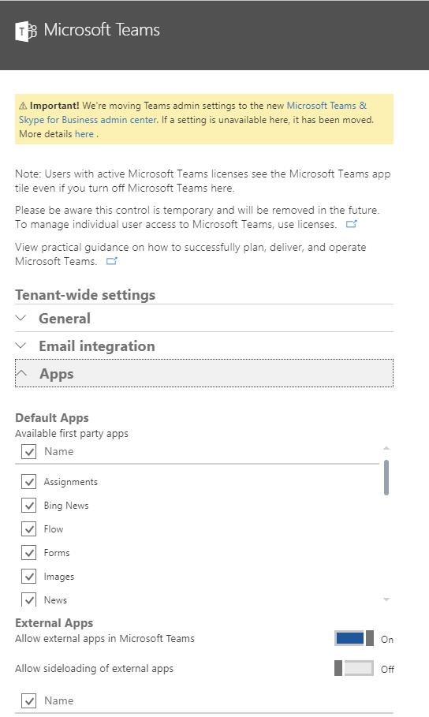
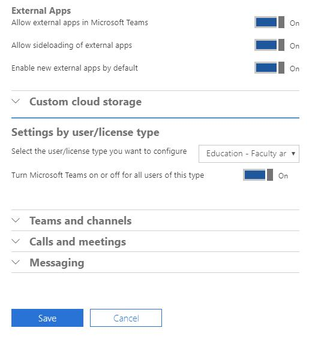
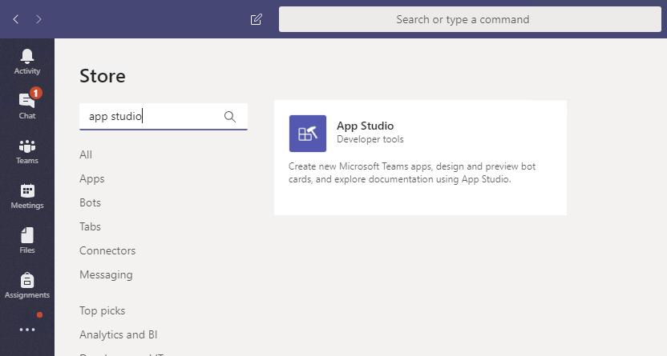

# Microsoft Teams

## Overview
In this lab, you will set up Microsoft Teams on your system and...

## Prerequisites

Complete [HOL 0](./../HOL0) to set up demo data in the School Data Sync Admin Portal.

## Exercises
This hands-on-lab has the following exercises:
* [Exercise 1: Set up Microsoft Teams](#ex1)
* [Exercise 2: Create a new team](#ex2)
* [Exercise 3: ...](#ex3)
---

## Exercise 1: Set up Microsoft Teams

1. Open a InPrivate or Incognito browser window (`Ctrl + Shift + P` in Edge and Internet Explorer and Firefox or `Ctrl + Shift + N` in Google Chrome)
 and browse to [teams.microsoft.com](https://teams.microsoft.com/). Click `Downloads` and select `Desktop (Windows 7+)` and click `DOWNLOAD NOW (64-BIT)`.

    

1. Execute the downloaded installer and when prompted login with your O365 Global Admin account credentials.

    

1. After the installation finished, complete the welcome wizard.

    

---
## Exercise 2: Create a new team

### Create a team

1. On the menu on the left click `Teams` and then click the `Create team` button in the center.

    

1. Select `Classes` as the team type.

    

1. Enter a `Name` for your team.

    

1. Find some students by entering a letter in the search box and add them to your team by clicking the names and clicking `Add`.

    

### Create a Class Notebook

1. Click `Set up Class Notebook`.

    

1. Follow the wizard by clicking `Next`.

    

1. Keep all the preselected features and click `Create`.

    

1. Wait for the wizard to finish.

    

### Create an Assignment

1. ....

    

1. ....

    

---
## Exercise 3: ...

### Allow external apps

1. Open a InPrivate or Incognito browser window (`Ctrl + Shift + P` in Edge and Internet Explorer and Firefox or `Ctrl + Shift + N` in Google Chrome)
 and browse to [portal.office.com](https://portal.office.com) and enter your O365 Global Admin account credentials. 

1. Click `Services & add-ins` and select `Microsoft Teams`.

    

1. Expand the `Apps` section .

    

1. Check `Allow external apps in Microsoft Teams` and `Allow sideloading of external apps` and `Enable new external apps by default`. Click `Save`.

    

### Install App Studio

1. In Microsoft Teams click `Store` which can be found on the bottom left.

    

1. Use the search to find `App Studio`.

    

1. Select `App Studio` and click `Install`.

    

### Create a ...

1. Click `Open` next to...

    

1. ...

1. ...

1. ...

---
## Continue with lab 4

You are now ready to start hands-on lab 4. [View HOL 4 instructions](../HOL4).

---
Copyright 2018 Microsoft Corporation. All rights reserved. Except where otherwise noted, these materials are licensed under the terms of the MIT License. You may use them according to the license as is most appropriate for your project. The terms of this license can be found at https://opensource.org/licenses/MIT.