# Microsoft PowerApps

## Content
* [Overview](#overview)
* [Prerequisites](#prerequisites)
* [Exercise 1: Create a class schedule app](#ex1)
* [Continue with lab 7](#continue)

---

## Overview
In this lab, you will create an app using PowerApps.

[Back to top](#content)

---

## Prerequisites

* Complete [HOL 0](./../HOL0) to set up an Azure account.

[Back to top](#content)

---

## Exercise 1: Create a class schedule app
Microsoft PowerApps are a very fast way to create apps based on your data. The sample data contains a class schedule and the resulting app can be used to browse the classes.

1. Open a InPrivate or Incognito browser window (`Ctrl + Shift + P` in Edge and Internet Explorer and Firefox or `Ctrl + Shift + N` in Google Chrome)
 and browse to [web.powerapps.com](https://web.powerapps.com/). Sign in and PowerApps Studio will load. On the home screen create a new app by selecting `Start from data`.

    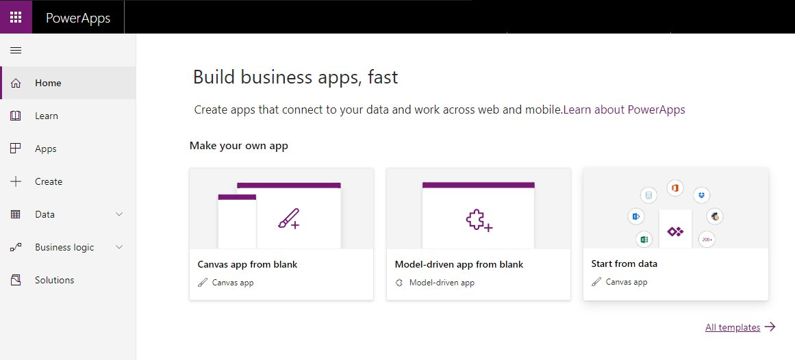

1. Click `Make this app`.

    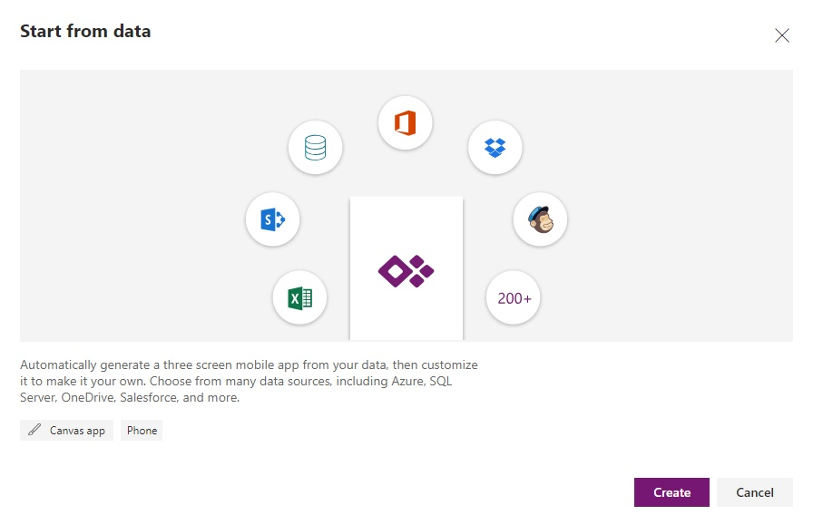

1. A new window will open. Confirm your region and click `Get started`.

    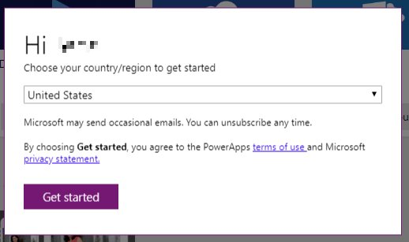

1. To connect data to be used as a basis for your app click `Phone layout` on the `OneDrive for Business` tile.

    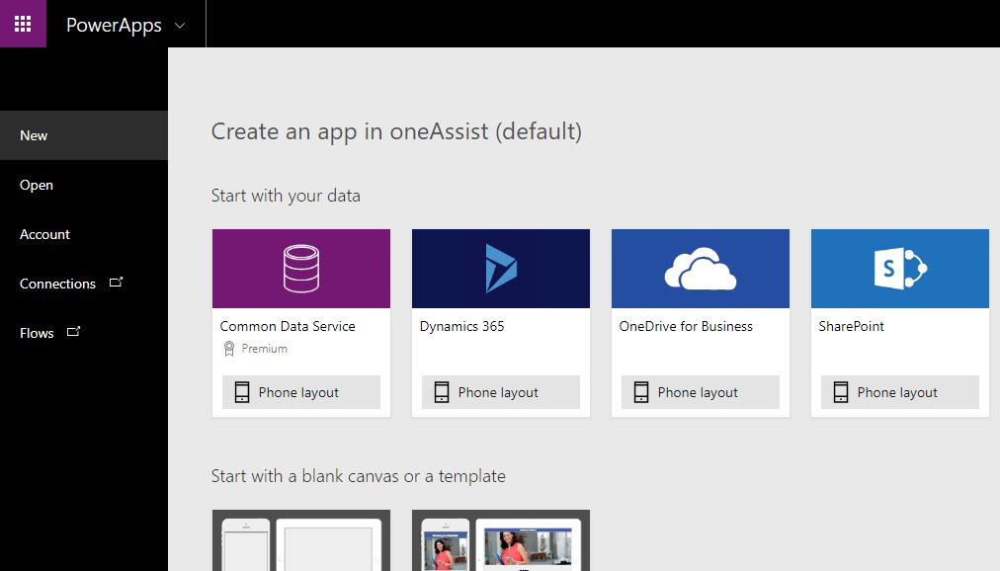

1. Click `Create` and you will be redirected to a list of your OneDrive files.

    

1. Open a new browser tab and navigate to [portal.office.com](https://portal.office.com/), sign in and click the `OneDrive` icon.

    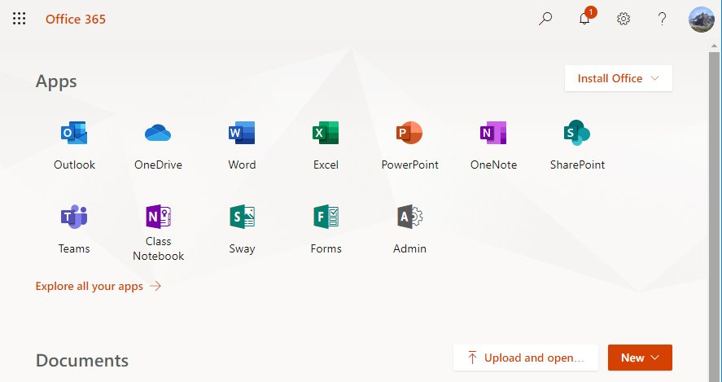

1. Download the prepared sample data [Classes.xlsx](./assets/Classes.xlsx) from the assets folder and upload it to OneDrive.

    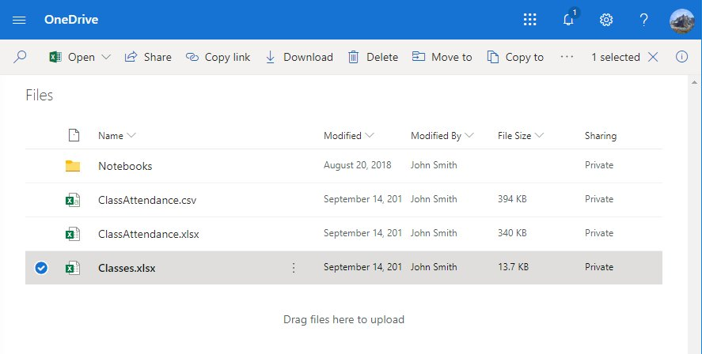

1. Return to the PowerApps tab and click the refresh button on the right to refresh your OneDrive files. Click `Classes.xlsx` next.

    

1. Select the `Schedule` table contained in the Excel file and click `Connect` at the bottom of the screen.

    

1. Click `Skip` to close the welcome message and to see a preview of the app that has been created for you.

    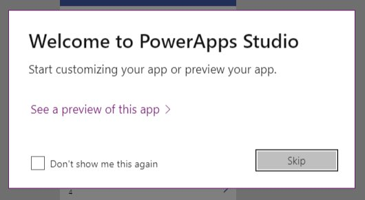

    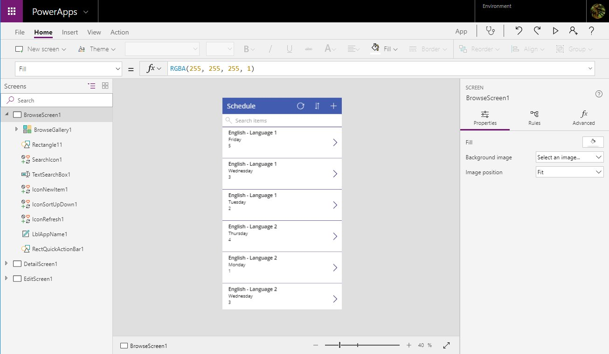

1. PowerApps Studio created a mobile app with three screens (you can see a list of the screens and their components on the left of the editor) and populated it with the sample data. As you can see the selection of displayed columns the app generator made is not ideal but you can easily change that. The `browse screen` shows a list of tiles. If you change one all the others will change accordingly. In the screens list on the left you can see that each time consists of a Separator, a NextArrow icon and three texts: Body, Subtitle and Title. When you select `Subtitle` the formula of the text will be displayed on the top of the screen. The current formula is `ThisItem.Day`.

    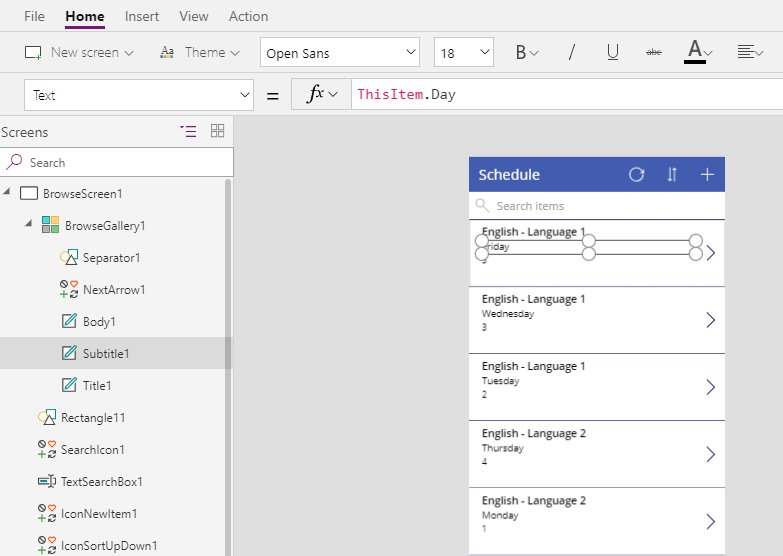

1. Change the formula to `ThisItem.Day&" - "&Left(ThisItem.Time,5)` and note how the text on all tiles changes to include not only the day but also the time of the class. Select the `Body` text next. The current formula is `ThisItem.DayOfWeek`. This is a numeric value that we included in the sample data to sort the classes but it is not a value you want to display to the user of the app.

    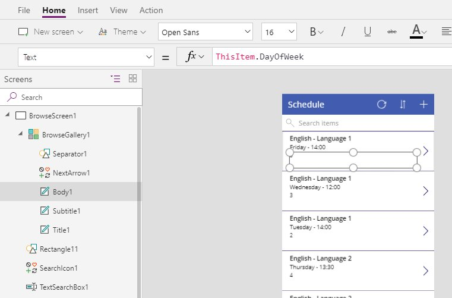

1. Change the formula to `ThisItem.Teacher` which is much more useful to the users. Select the `IconNewItem` next.

    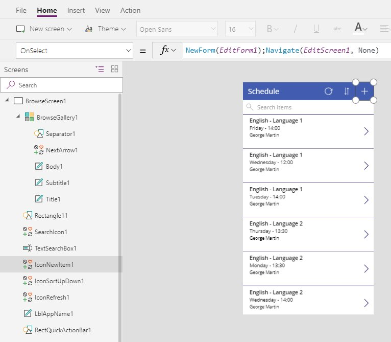

1. Since the class schedule is fixed there is no need for an add button. Right-click and delete it. Notice that the menu on top of the app will collapse. The reason is that the items on the menu have been positioned with formulas that contain a (now broken) reference to the deleted icon. PowerApps Studio highlights the errors in red. Click on one of the red icons to fix the first error. The formula containing the error will be displayed in the formula editor. Remove the `- IconNewItem1.With` part to fix the formula. Repeat the process for all red icons.

    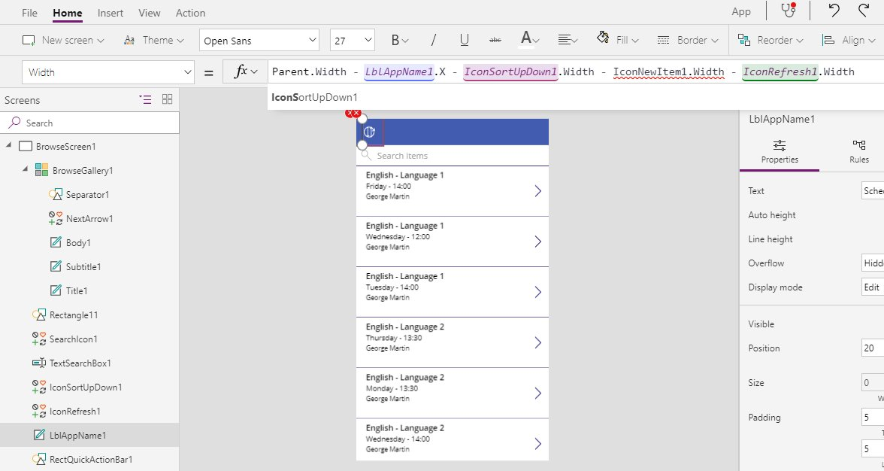

1. Next you are going to change the sort order of the tiles. By default they have been sorted by the class name. You are going to change that order to day and time. Select the `BrowseGallery` and change the formula to `SortByColumns(Search(Schedule, TextSearchBox1.Text, "Class","Teacher","Day"), "DayOfWeek", If(SortDescending1, Descending, Ascending), "Time", If(SortDescending1, Descending, Ascending))` and note how the Monday classes are now at the top of the list. By changing the formula you also changed the columns that will be searched when the user types something in the search field above the schedule. Now the columns `Class`, `Teacher` and `Day` will be considered. So the user could type search terms like `Science`, `John` or `Friday` to filter the list.

    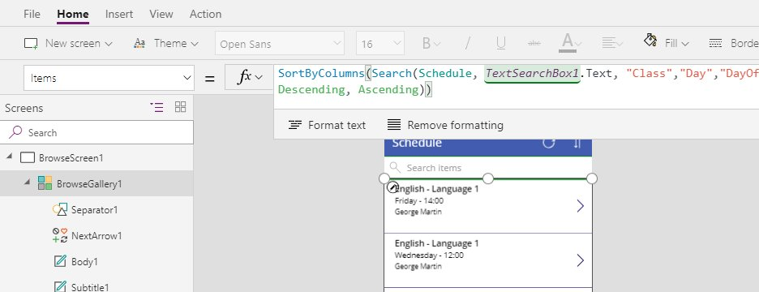

1. The home screen is now finished. Let's move on to the details screen. Select it and delete the `DayOfWeek_DataCard` from the `DetailForm` by right-clicking it.

    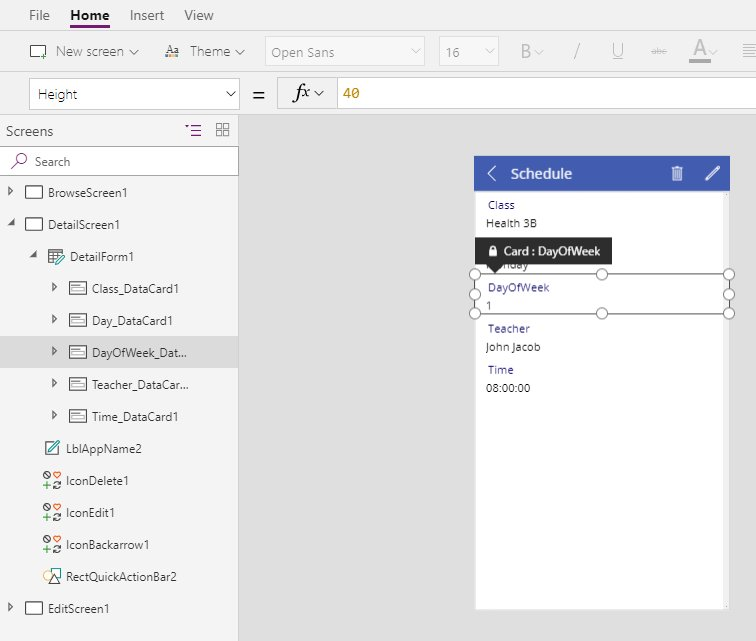

1. Next remove the `IconDelete` and `IconEdit`. This will again collapse the menu on top of the screen. Fix the errors like before by clicking the red icon next to `LblAppName` and removing ` - IconDelete1.Width - IconEdit1.Width` from the formulas.

    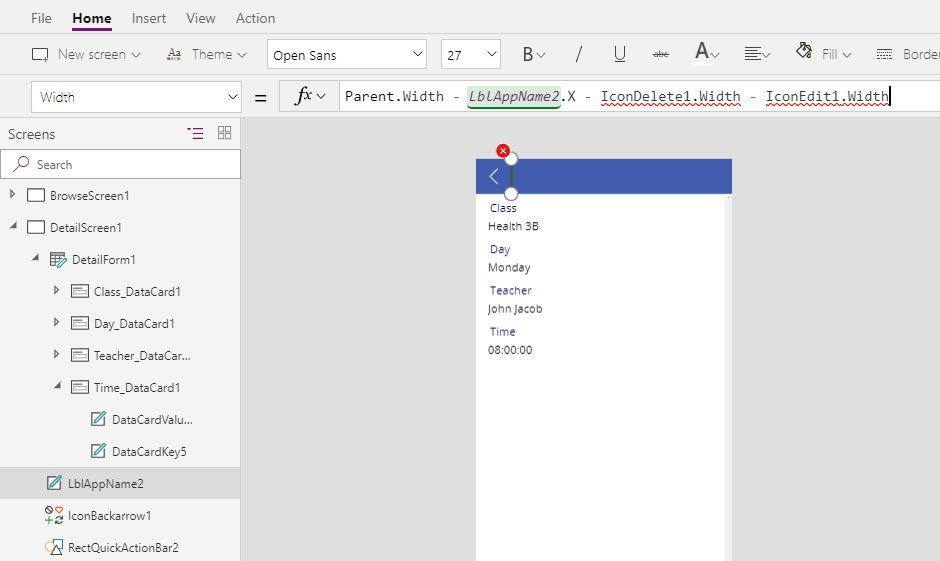

1. The details screen is now finished. The last thing to do is remove the unnecessary edit screen. Select it and delete it by right-clicking it.

    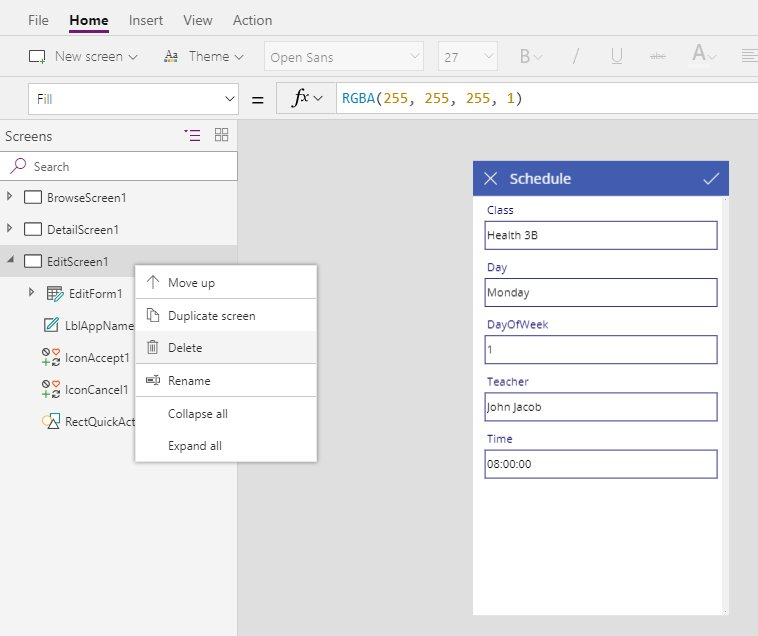

1. Your app is finished. Click `File` -> `Save`, enter a name for the app and click `Save` at the bottom of the page.

    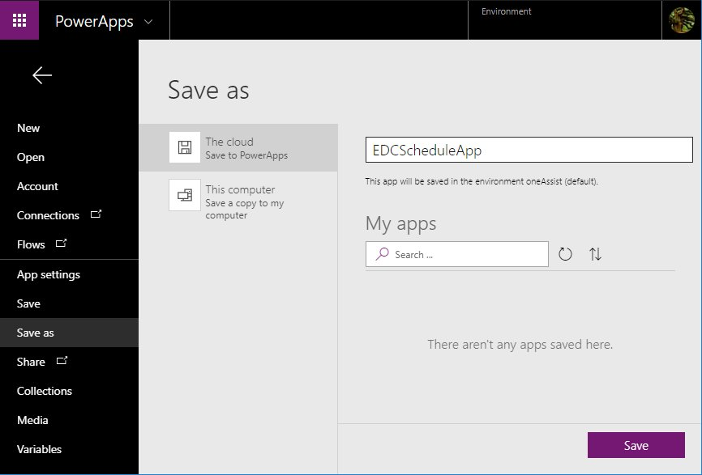

    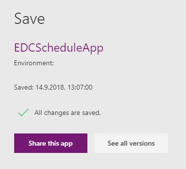

1. Close the tab and return to the PowerApps home page. When you click `Apps` you will find your new app.

    

1. Click the three dots and select `Play` to test your app. A new tab will open showing you a phone emulator running your app.

    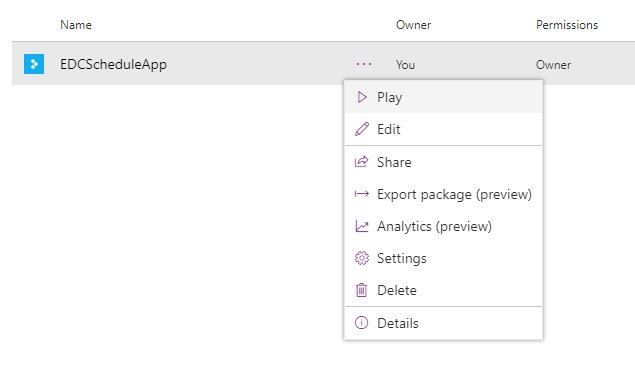

    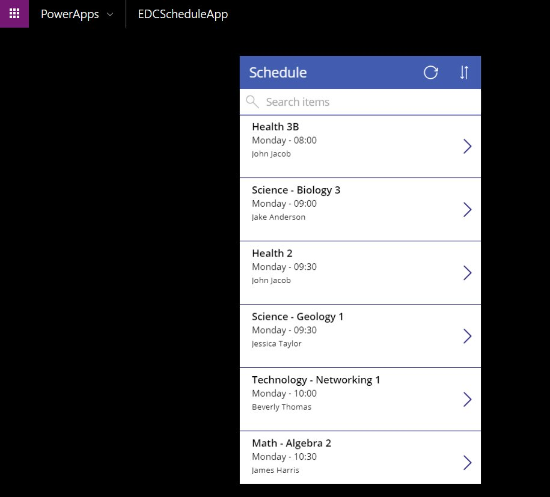

1. Click the arrows to see the details of a class or type into the search to filter the displayed classes.

    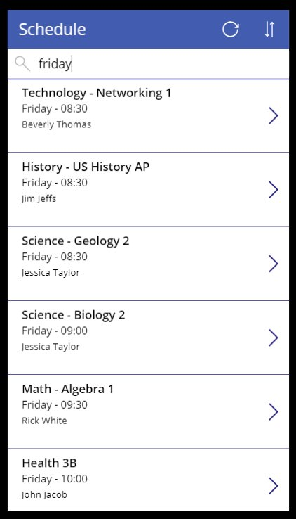

[Back to top](#content)

---

## Continue with lab 7

You are now ready to start hands-on lab 7. [View HOL 7 instructions](../HOL7).

[Back to top](#content)

---

Copyright 2018 Microsoft Corporation. All rights reserved. Except where otherwise noted, these materials are licensed under the terms of the MIT License. You may use them according to the license as is most appropriate for your project. The terms of this license can be found at https://opensource.org/licenses/MIT.