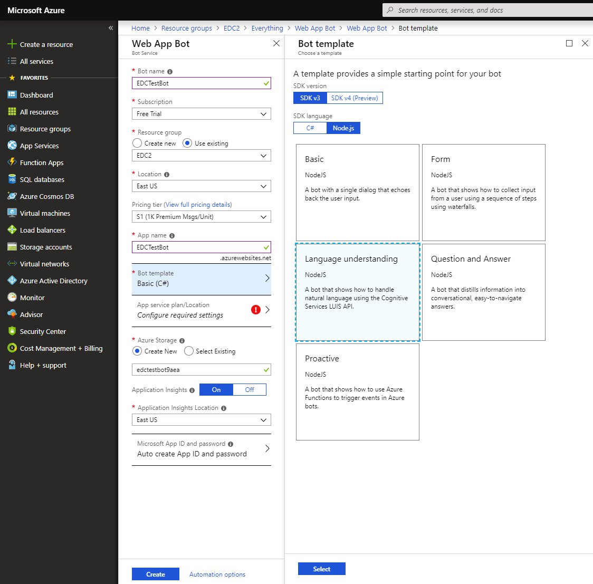
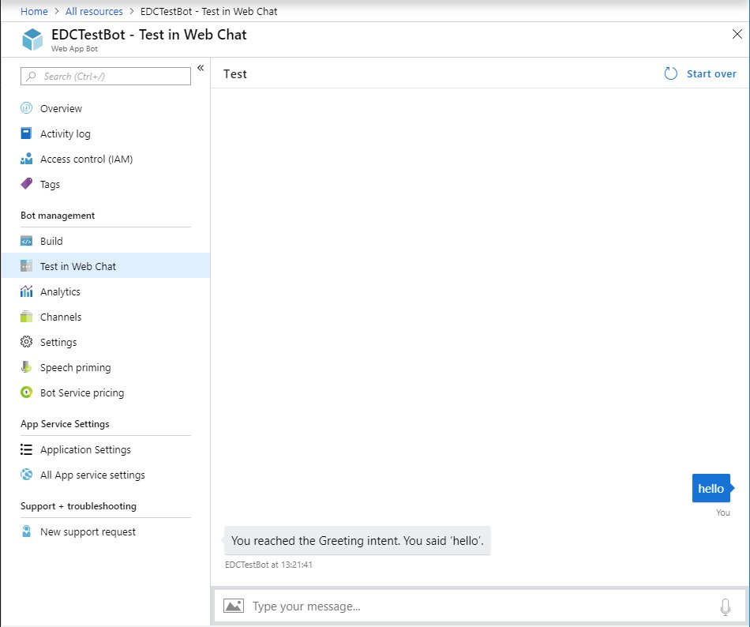
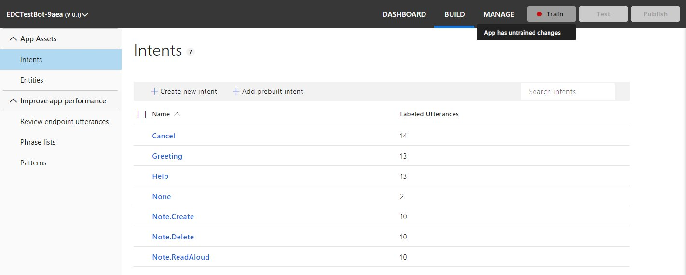

# Bot Framework

## Content
* [Overview](#overview)
* [Prerequisites](#prerequisites)
* [Exercise 1: Coming soon](#ex1)
* [Continue with lab 7](#continue)

---

## Overview
In this lab, you will learn how to create an Azure bot, make it available in Teams and use Language Understanding to identify the user's intent. The bot will help the students by taking notes for them.

[Back to top](#content)

---

## Prerequisites

* ...

[Back to top](#content)

---

## Exercise 1: Create a Language Understanding bot with Bot Service

1. Open a InPrivate or Incognito browser window (`Ctrl + Shift + P` in Edge and Internet Explorer and Firefox or `Ctrl + Shift + N` in Google Chrome) and browse to [portal.azure.com](https://portal.azure.com) and sign in. Select `Create new resource` in the menu blade and search for `bot`.

    

1. Select the `Web App Bot` from the results.

1. In the `Bot Service blade`, provide the required information, and click `Create`. This creates and deploys the bot service and LUIS app to Azure.

    1. Set `App name` to your bot's name. The name is used as the subdomain when your bot is deployed to the cloud (for example, `edcbot.azurewebsites.net`). This name is also used as the name of the LUIS app associated with your bot. Copy it to use later, to find the LUIS app associated with the bot.

    1. Select the `subscription`, `resource group`, `App service plan`, and `location`.

    1. Select the `Language understanding (Node.js)` template for the `Bot template` field.

    1. Note that Azure will automatically create a storage and an App ID for your bot.

1. Confirm that the bot service has been deployed. Click `Notifications` (the bell icon that is located along the top edge of the Azure portal). The notification will change from `Deployment started` to `Deployment succeeded`. After the notification changes to `Deployment succeeded`, click `Go to resource` on that notification.

[Back to top](#content)

---

## Exercise 2: Try the bot

1. Once the bot is registered, click `Test in Web Chat` to open the Web Chat pane. Type `hello` in Web Chat. The bot responds by saying `You have reached Greeting. You said: hello`. This confirms that the bot has received your message and passed it to a default LUIS app that it created. This default LUIS app detected a Greeting intent.

1. Try `can you help me?` and see how the bot recognizes your help intend.

1. And `I wish to cancel` or variations of the texts.

Your bot is now running and can recognize some basic intents. Next you are going to add intents that correspond to taking and deleting notes.

[Back to top](#content)

---

## Exercise 3: Modify the LUIS app

1. Log in to [www.luis.ai/applications](https://www.luis.ai/applications) using the same account you use to log in to Azure. Click on `My apps` if you are not redirected automatically. In the list of apps, find the app that begins with the name specified in `App name` in the Bot Service blade when you created the Bot Service.

1. The LUIS app starts with 4 intents: `Cancel`, `Greeting`, `Help`, and `None`.

[Back to top](#content)

---

## Exercise 4: Modify the bot code

Coming soon...

[Back to top](#content)

---

## Exercise 5: Test the bot

Coming soon...

[Back to top](#content)

---

## Continue with lab 7

You are now ready to start hands-on lab 7. [View HOL 7 instructions](../HOL5).

[Back to top](#content)

---

Copyright 2018 Microsoft Corporation. All rights reserved. Except where otherwise noted, these materials are licensed under the terms of the MIT License. You may use them according to the license as is most appropriate for your project. The terms of this license can be found at https://opensource.org/licenses/MIT.